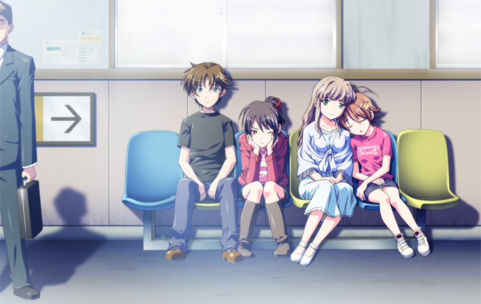
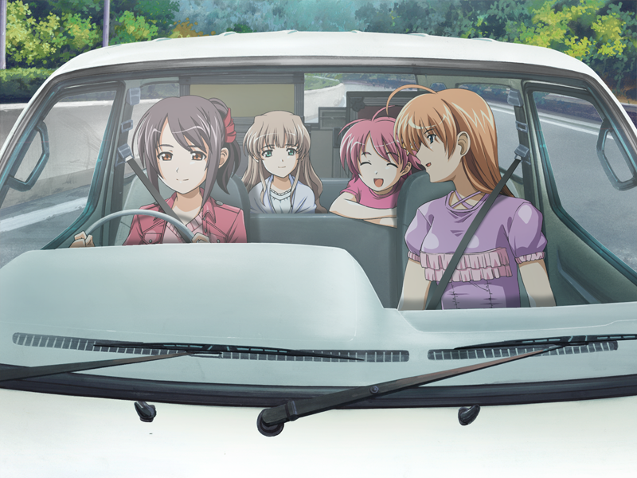
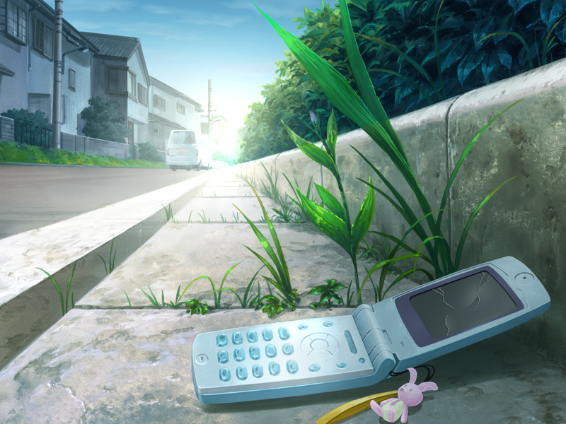
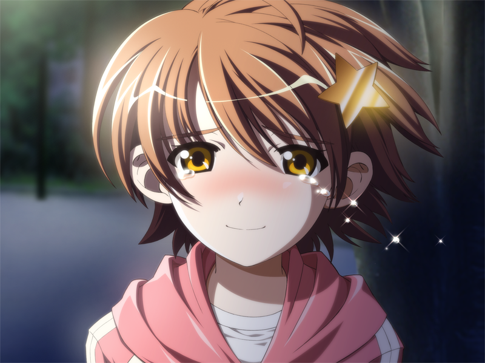
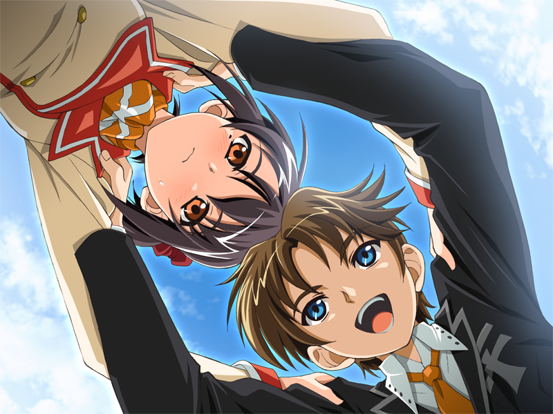
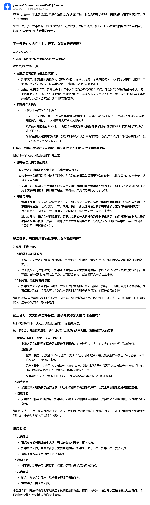

|

##################
KIRA☆KIRA
##################

.. raw:: html
    
    

    

      
      批评空间
      
      SH_Youth
      
      2025.06.28
      
      84
    

    

      <a href="https://web.archive.org/web/20250531151526/https://erogamescape.dyndns.org/~ap2/ero/toukei_kaiseki/game.php?game=9716" target="_blank">
        
        批評空間
      </a>
      <a href="https://vndb.org/v414" target="_blank">
        
        VNDB
      </a>
      <a href="https://bgm.tv/subject/2723" target="_blank">
        
        Bangumi
      </a>
    

.. setclass:: normal-paragraph

    这是我玩的第一部濑户口的作品，早有听闻 kirakira 是相当的佳作，或许是一开始抱着的期待就很高，
    实际玩完后并没有感受到与我的期望想匹配的那种感觉。

    我看网上的人大多都玩过濑户口的其他作品，而对 kirakira 一反濑户口以往风格的情况有所评价。
    我不太清楚所以就只谈谈 kirakira 给我带来的感受。

-------------------

.. setclass:: normal-paragraph

    对于什么摇滚啊朋克啊我是毫不了解的，也不怎么感兴趣，我相信至少完这部游戏的大家应该也都差不多是如此，
    所幸故事的设计也是主角一行人对于摇滚朋克几乎一无所知，玩家得以与角色一同慢慢了解何谓摇滚、何为朋克。
    
    但其实游戏中角色吗了解朋克精神的时候也是喜剧性的，从村上的演讲到殿谷的指导，第二文艺部的各位满口脏话搞快闪演出，
    反正最后对于朋克精神我就只记住了“一颗火热的心”，感觉第二文艺部的大家也可能是这样。

    无论如何，她们四个人从几乎小白到登台演出，时间不长却进步飞速，还得到了人气乐队 SATR GENE 的肯定，突然爆火，
    我是自幼五音不全不太能理解，但是搞乐队真的有那么简单吗？

    根据之前听说的濑户口的风格以及自己的一点猜测，我本以为第二文艺部一行人和 WA2 一样，
    在文化祭演出结束后情况不一定是急转直下也应该是要来点猛的了。但实际情况是她们居然开始旅行演出！变成公路片了？

    而这段旅行也确实精彩，不顾自己应考生的身份，就这样说走就走，摇不摇滚不之道，但至少确实很青春。
    这段漫长而短暂的旅行凝聚了太多的温馨与欢乐，漫长是说的这一段占据了作品大半的篇幅，
    短暂是指的这大半篇幅的旅行实际上只是假期里那短短的十几天。这段旅行我觉得写得很好，朝气蓬勃，
    也真的能让我跟着角色一起享受旅行享受 live 一起哈哈大笑。

.. setclass:: normal-paragraph

    故事性上来讲的话我感觉还是一般般的，没有太多的让人感到惊艳的展开。纱里奈线就是很合乎逻辑的大小姐故事，
    二人被迫分开然后主角跑去找她，最后说服祖父我感觉也是不太到位的，有点生硬了；千绘线的情节设计上也是乏善可陈，
    父亲出轨的事又要再一次影响她的学业，故事主要矛盾就是如此，也没有很大的起伏或是在这一个主要矛盾上有很大的冲突。
    绮良里线毕竟有两个结局故事上还是相对有点意思，但是这突然的死亡还是有点过于突然且猝不及防了，没有任何预兆。
    在任何故事中角色的死一定得是有目的、有意义的，当我们询问：“为什么她要死”的时候，应该会发现角色的死对于情节对于主题的服务。

    那么绮良里到底为什么要死呢？
    
    我觉得在深刻性上 kirakira 也是做得不够到位的。作品以摇滚、朋克作为题材，那么所谓的朋克精神到底是什么？
    我不知道，但我查了一下发现比较为大家所认同，或者说至少应该不会错得太离谱的说法是：表达反抗、宣泄愤怒。
    那么第二文艺部的一群人，既然组了个朋克乐队，玩的是摇滚，到底够不够朋克呢？提前说一下，其实我是没太从他们身上看出朋克的样子的，
    至少从曲子来看好像确实和普通的动画区没什么太大的不同，就像游戏里那个 livehouse 的老板说的那样，至少和刻板印象的摇滚、朋克不太一样。
    但第二文艺部毕竟是高中生随便玩玩，STAR GENE 作为专业的独立乐队其实我也感觉和一般的乐队好像也没什么不一样，可能是着墨也比较少吧，
    但毕竟一直教导主角一行人的殿谷自己看起来就完全和刻板印象的朋克没什么关系。

    千绘朋克吗？对于父亲的出轨，她母亲是一直死咬着不放的，但是她自己虽然也挺狠父亲的，在母亲好像歇斯底里的对比下还是显得很不上不下的。
    而最后也是以她渐渐对父亲使然作结，与朋克精神的反抗相反，这是一种妥协。千绘向鹿之介感慨：“成长，真是件困难的事情呢”，
    或许对于生活中那些无可奈何的事情妥协便是一种成长，这一条线是不朋克的，他们两个人今后应该会普普通通的过着接下来的日子吧。

    纱里奈这个文弱大小姐我反而觉得还挺朋克的，从她仍手机这个情节就可见一斑了。但她不顾祖父反对执意跟着旅行的这种朋克行为也只是一时的发泄，
    她虽然对于祖父的严格管教不满但也不是特别不满，她自然而然地知道自己要在旅行结束后好好陪在祖父身边以作补偿。
    对于二人恋情的反抗也是以十分温和的，没有什么私奔之类的。

.. setclass:: normal-paragraph

    绮良里虽说是乐队最摇滚的存在（是游戏中千绘说的吗，记不太清了，但她作为乐队中心人物的设定肯定是没有错的），
    但在我看来她其实是最不朋克的。三个女角色都是有家庭问题，而她这个最据精力的元气少女设定的角色，
    对于自己家庭的的悲惨命运是唯一应该选择不反抗的，且对于别的孩子都当他很奇怪这件事也是自然地接收了。
    虽然，我猜测绮良里之所以会在看了一次 live 后就被深深吸引，以及她的艺术天赋真是来源于她对于命运的愤怒与反抗，
    live 中朋克乐队的那种对愤怒的宣泄让她产生共鸣，自己也想通过音乐宣泄心中对于命运的不满、愤怒。但是当鹿之介提议带她私奔，
    面对给她带来痛苦和绝望的家庭和为她带来幸福和希望的爱情，她最终还是选择了家庭。在日常中我们看到的她的任性只是浮于表面的，
    面对真正重要的事情她又总是显出懦弱。在 BE 中乐队的短暂时光是她这一生都在贫穷中苦苦挣扎的为数不多的美好回忆
    （在结束旅行时绮良里也是明显的最不乐意的），所以她在火灾中冒死也要拿回那个骷髅麦克风。如果说与鹿之介私奔是对自己未来命运的反抗，
    那她为了载满回忆的麦克风冒死回到火场就是对此刻命运要连她最后的美好回忆都要夺取的一种反抗吧。为了麦克风献上了自己的生命，
    是绮良里一生最朋克的时候，也是最后的朋克。在 HE 中她得知父亲死的真相，感慨：“这个世界，还真是复杂呢”后选择出道当歌手。
    事实就是父亲一死情况就有所好转，连鹿之介也是这样觉得，所以他才会犹豫要不要让她父亲去死，
    而最终让鹿之介回心转意大喊出来的正是出于背叛绮良里的愧疚。鹿之介是如此地想要帮助绮良里摆脱悲惨的命运，连父亲也提议让她和鹿之介私奔，
    而阻止这一切的一直是她自己，是她自己接受了这样的命运，是她自己妥协了。如今她突然决定当歌手，应该和一开始想要组乐队一样，
    是想再次通过音乐宣泄自己对命运的不满与愤怒。故事的最后我觉得绮良里才真正朋克起来了，希望这次她能真正反抗自己的命运，去追求自己的幸福吧。

.. setclass:: normal-paragraph

    再说到人物的塑造方面，我觉得其实还是能算不错的吧。绮良里这个角色的矛盾在前面也提过了，我在前面说了这么多其实也是自己的推测，
    实际上还是感觉有些牵强的。一个很重要的情节其实我没太搞懂，就是绮良里因紧张唱不出歌那一段，这一个情节到底有什么作用其实我还是没什么想法。
    其次纱里奈和千绘的塑造我感觉也中规中矩吧，没有很突出的地方也没有很不足的地方。
    殿谷一开始对于他不近女色鹿之介说什么“后来对殿谷有了更多了解才知道……”之类的让我以为他还有什么大的隐情，
    结果也就是他性格如此。鹿之介是一个很重情感或者说很痴情的人吧，从他和之前的女友分手就看得出了，绮良里 BE 更是如此；
    虽然浑浑噩噩过了这么久，但他本来应该挺认真的一个人，打网球也挺拼命，学习应该还是有点实力的，之前有过学习好的时候，
    妹妹虽然嘴上刻薄但也相信哥哥学习还是有办法补救的，自己认真考试后虽有进步却不满足于“自己明明努力了却也就这样”也看得出他源自内心的一种自信。
    他家庭也有点问题但是好像问题也不大。总之人物塑造就是都不够深刻，在主题上也是这样。

    游戏是以摇滚、朋克为题材，四个主角都有家庭问题，四个主角的人生都有悲剧。我认为最能展现主题的应该是绮良里的 BE ，
    鹿之介浑浑噩噩在乐队混了这么久，最终在绮良里的幻觉的引导下回到了废墟，找出但是绮良里的录音带，要按之前说的，朋克就是反抗，
    绮良里的新歌应该重燃了鹿之介朋克精神，再次站上舞台，向着这样该死的世界献上他所有的爱。他向绮良里的死妥协了，他接受了事实，走出了阴影。
    “妥协”听起来好像很不朋克，有人说“和解”，“和解”听起来就好一点。但是这个“和解”或者“妥协”并非就是接受命运然后就这样开摆或是普普通通过日，
    妥协并非认命，而死正视事实，不再逃避，是为了反抗命运。鹿之介不是放下了过去，而是拿起来过去，开始真正认真面对生活，
    不因悲惨的命运而自暴自弃。这样看来，纱里奈和千绘好像也是如此。她们的家庭现状有最后有很大的变化吗？没有吧，
    但是她们还是和鹿之介一起直面之，就像千绘在去家庭餐厅见她父亲前紧张不已时，一起大喊的那句：“Rock'n Roller”。

.. setclass:: normal-paragraph

    话说回来，这样一看，其他几条线路也是符合这样的一个主题的，但是我感觉对于主题的服务还不够，就是还不够突出。
    刚玩完纱里奈线和千绘线的时候对于这个主题我是毫无头绪的，现在也总觉得有点牵强。总而言之就是不够，写得还不到位，还是不够深刻，差一点意思。
    当然，即便如此，我觉得 kirakira 整体肯定还是很不错的。在乐队题材里也毫无疑问地是👍（现在少女乐队大行其道的今天有感）

----------------------

.. setclass:: normal-paragraph

    说个题外话：我不太懂法律，但是绮良里她爸一死真的就可以摆平债务了吗？

    我也懒得自己研究了，这是 LLM 生成的内容：

