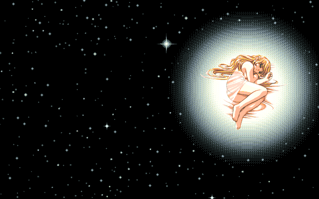
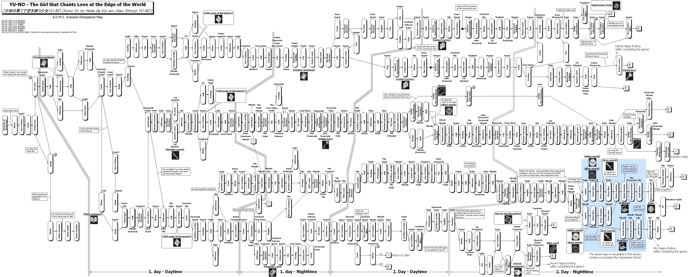

|

#############################
在世界尽头咏唱恋曲的少女YU-NO
#############################

.. raw:: html
    
    

    

      
      批评空间
      
      SH_Youth
      
      2025.07.15
      
      89
    

    

      <a href="https://web.archive.org/web/20250701183206/https://erogamescape.dyndns.org/~ap2/ero/toukei_kaiseki/game.php?game=2093" target="_blank">
        
        批評空間
      </a>
      <a href="https://vndb.org/v1377" target="_blank">
        
        VNDB
      </a>
      <a href="https://bgm.tv/subject/1075" target="_blank">
        
        Bangumi
      </a>
    

.. setclass:: normal-paragraph

  久闻 YUNO 的大名，满怀期待的玩完了，却又有点失望，为什么呢？

  我看网络上有人说，YUNO 那些前卫的设计已经被后人借鉴太多，如今的玩家再玩早就习以为常，没办法体验到上世纪的玩家初见 YUNO 的震撼了。
  我觉得可能有点道理，但毕竟我也是现在的人，对那个年代了解不多，很难说这种说法有多少是对的。

  我仔细想了想，比起 EVER17 之类的作品，YUNO 反而没有给我带来多少豁然开朗或是其他让人眼前一亮的震撼。
  有一种可能就是我是照着网络上的人已经总结好的 Scenario Divergence Map 玩完的。
  由于事先已经有了完整的 Map 我也就对情节的发展有了大致的预期，尤其是已经事先知道了后半部分异世界篇的存在，
  约等于在某种程度上已经被剧透了一部分了，也就少了很多让我对于突入其来的展开感到震惊的空间。
  然而我认为这就是 YUNO 这部游戏最大的一个不足所在：你要一点也不想被剧透，就必须忍受那枯燥游戏玩法；
  你要想要避免在游戏里满世界的乱跑乱点，就必须要被 Map 或是其他攻略先剧透一点。

  其实到我达到的第一个 E 为止我都是自己慢慢摸索的，看看 Map 那么长的线路，每个点都是我满世界跑了个遍，
  好不容易触发对话还可能要满屏幕乱点再触发接下来的情节。这要自己一点一点绕完得到什么时候？是故选择了照着 Map 选好线路来玩。
  结果就是，每每揭示真相或是照应前文的时候，我总是：“哦，原来如此”，或是：“哦，果然如此”；
  情绪波动最大的永远是读档之后忘记存回去的时候，总能让我红温好一阵子。

.. setclass:: normal-paragraph

  常常为人所称道的是 YUNO 的 A.D.M.S. 游戏系统于情节设定融合之巧妙、世界观的完整、以及其颠覆性的非线性的叙事。
  这确实是这样的，毋庸置疑。但除此之外感觉也很少有什么是值得称道的了，人物刻画一般、全部玩完也很难所有什么明确深刻的主题，
  情节上到了异世界篇也是匆匆忙忙，寥寥草草就结局了。

  另外对于有极强的处女情结的我来说玩着还是有点太难受了，唯有澪可以抚慰一下我受伤的心灵吗。

  Well，就感觉上来说，玩完感觉内心很平静，我一般也很难给出高的评价了，但 YUNO 的历史意义总是不能忽略的。
  我们在评价不论人还是人的作品总是不能脱离其历史背景的，然而我对于历史不甚了解，但我相信批评空间如此的一往高分应该是肯定有道理的，
  综合下来我认为89至少在我的心里是比较平衡的。
