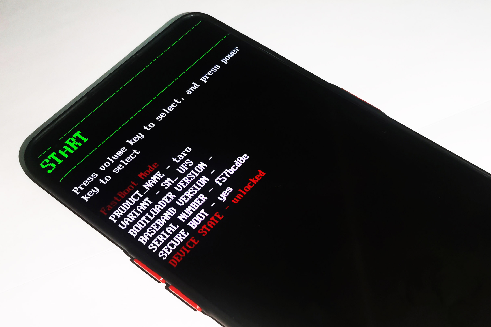

|

#######################################
记录初次搞机：OnePlus 10 Pro root 之路
#######################################

.. raw:: html
  
  

  

    
    日记残念
    
    SH_Youth
    
    2025.08.08
  

.. image:: https://moe-counter.sai-hentai.dpdns.org/blog-daily-1/
   :alt: 访问量统计
   :align: right
   
|

近来捡回了部二手的一加 10 Pro，打算尝试 root。之前虽也早就像试试的，但奈何一直用了五六年的旧手机很难解锁，我也不想承担相应的损失唯一一部手机的风险，故一直搁置着。随着旧手机越来越难堪重负（代理网速一快就卡死自动重启），终于想着再添加一部手机。说是添加是因为旧的也还在用，把相应的需求迁到新的 root 的手机上，老的手机就完成些日常生活需要的功能，这样我也无需顾虑要把 root 隐蔽得有多好了。

一加的手机我不太了解，只知道它解锁应该是最简单的了，但这也就够了，所以这次是专门挑着一加的手机捡的。

然这么多年虽然不能说是一直心心念念，但也时不时惦记着 root 的事，尤其是不时遇到我想要的功能但是要 root 的时候，总是很不爽。虽说如此，但也没有说就有去专门了解，因为这肯定是越看越想自己上手的，这要上手就要斥资买手机，所以是忍不得就看不得的，以至于我现在对此依旧接近一无所知。

所以以下是一些近乎小白入门的记录和经验，如果未来有人看了能有所参考，那就是赚到了。

======================
事前准备
======================

有一些工具肯定是需要的，首先肯定是 adb 不消说，从 Android SDK 中下载
`platform-tools <https://developer.android.google.cn/tools/releases/platform-tools>`_
解压即可。

如果是 Windows 的话还有一个驱动要装，我一开始没装驱动，结果一进 fastboot 就连不上手机，百思不得其解，后来才发现是驱动没装的缘故。

.. raw:: html
  
  
装上这个就可以了：
  <s><a href="https://developer.android.google.cn/studio/run/win-usb">Google USB 驱动</a></s>
  

然而顶级域名 cn 的 Android Developer 的这个下载链接点进去是 404 的，又让我百思不得其解好久😓。这里这个才行：
`Google USB 驱动 <https://developer.android.com/studio/run/win-usb>`_
解压后，右键点击 ``android_winusb.inf`` 选择安装即可。

==========================
解锁 bootloader
==========================

.. warning:: 

  解锁 bootloader 会清除手机数据，所以要提前备份好数据。

一加的手机解锁 bootloader 是最简单的，直接在手机上开启开发者选项，然后打开 OEM 解锁和 USB 调试就行了。

  开启开发者选项: ``设置`` - ``关于手机`` - ``版本信息`` 狂点版本号 7 次

  开启 OEM 解锁: ``设置`` - ``系统`` - ``开发者选项`` - ``OEM 解锁`` 打开
  
  开启 USB 调试: ``设置`` - ``系统`` - ``开发者选项`` - ``USB 调试`` 打开

然后连接电脑，在 platform-tools 所在路径打开终端，输入 ``adb reboot bootloader`` 重启到
fastboot 模式，可以看到最下面红色的 ``DEVICE STATE - locked`` ，即上锁状态。

再输入 ``fastboot flashing unlock`` ，使用音量键上下选择 ``UNLOCK THE BOOTLOADER``，按电源键确认即可解锁 bootloader。

如果像我一样卡在 ``waiting for device`` 的话，可能就是驱动没装好。装好上面的驱动后，在
``设备管理器`` 中找到 ``Android Device``，发现它带着 ❔ 或 ⚠️。右键选择
``更新驱动程序`` - ``浏览我的电脑以查找驱动程序(R)`` -
``让我从计算机上的可用驱动程序列表中选取(L)`` - ``Android Device`` -
``Android Bootloader Interface`` 确认即可。

解锁后手机会重启，并且清除数据，再回到手机上开启开发者选项，这时会发现 
``OEM 解锁`` 是灰色的无法操作，这说明解锁成功了。我们在打开 ``USB 调试`` 就行了。

==========================
获取 root 权限
==========================

怎么获取 root 权限？方案好多。

首先是一直有所耳闻的 Magisk，然后是它的各种分支， Magisk Alpha、Kitsune Magisk
（原 Magisk Delta）等等。现在又有 KernelSU，以及它的分支 KernelSU Next、SukiSU Ultra
等等。还有 APatch 等等。要选哪个？

毕竟我也还是半个小白，这里也很难给出它们的各种差异以及优劣对比。总之我听说 KernelSU
是新兴的内核级的解决方案，听着就很高级，而且对传统的 Magisk 的大多数模块也都兼容，隐蔽性也可能更好，所以我就选了它。

--------------------------
安装 KernelSU
--------------------------

什么是 KernelSU？官网这样写的:

  KernelSU 是 Android GKI 设备的 root 解决方案，它工作在内核模式，
  并直接在内核空间中为用户空间应用程序授予 root 权限。

Android GKI (Generic Kernel Image) 2.0，是在 Android 12 上引入的，内核版本应该是 5.10 以上的。所以并非所有 Android 设备都支持 KernelSU。

幸好幸好的是，我的这部一加 10 Pro 刚好是 Android 12 内核版本 5.10。

从 `KernelSU GitHub Releases <https://github.com/tiann/KernelSU/releases>`_
下载最新的 KernelSU 管理器 ``KernelSU_vX.X.X_XXXXX-release.apk``，安装到手机上并打开，如果显示 ``不支持`` 那就是不支持，如果显示 ``未安装`` 那就是 OK 的。

++++++++++++++++++++++++++
选择安装方式
++++++++++++++++++++++++++

现在 KernelSU 有两种安装方式：

1. ``GKI`` (Generic Kernel Image): 使用 **通用内核镜像** （GKI）替换掉设备原有的内核。
2. ``LKM`` (Loadable Kernel Module): 使用 **可加载内核模块** （LKM）的方式加载到设备内核中，不会替换掉设备原有的内核。

具体差异参考官方文档 `KernelSU 安装介绍 <https://kernelsu.org/zh_CN/guide/installation.html#installationintroduction>`_:

  **GKI模式**
  
  GKI 模式会替换掉设备原有的内核，使用 KernelSU 提供的通用内核镜像。GKI 模式的优点是：

  1. 通用型强，适用于大多数设备；比如三星开启了 KNOX 的设备，LKM 模式无法运作。还有一些冷门的魔改设备，也只能使用 GKI 模式；
  2. 不依赖官方固件即可使用；不需要等待官方固件更新，只要 KMI 一致，就可以使用；

  **LKM模式**

  LKM 模式不会替换掉设备原有的内核，而是使用可加载内核模块的方式加载到设备内核中。LKM 模式的优点是：

  1. 不会替换掉设备原有的内核；如果你对设备原有的内核有特殊需求，或者你希望在使用第三方内核的同时使用 KernelSU，可以使用 LKM 模式；
  2. 升级和 OTA 较为方便；升级 KernelSU 时，可以直接在管理器里面安装，无需再手动刷写；系统 OTA 后，可以直接安装到第二个槽位，也无需再手动刷写；
  3. 适用于一些特殊场景；比如使用临时 ROOT 权限也可以加载 LKM，由于不需要替换 boot 分区，因此不会触发 avb，不会使设备意外变砖；
  4. LKM 可以被临时卸载；如果你临时想取消 root，可以卸载 LKM，这个过程不需要刷写分区，甚至也不用重启设备；如果你想再次 root，只需要重启设备即可；

怎么选？官方推荐的是手机优先考虑 LKM 模式；模拟器、WSA等优先考虑 GKI 模式。所以我选择了 LKM 模式。

++++++++++++++++++++++++
使用 LKM 模式安装
++++++++++++++++++++++++

我的手机支持 ``fastboot boot``，所以可以使用最简单的方法，即官方推荐的:

  使用 ``fastboot boot`` 临时启动 KernelSU 提供的 GKI 内核，然后安装管理器，最后在管理器中直接安装。

因为是临时启动，所以不会替换掉原有的内核，十分安全，不太会变砖。

KernelSU 是 Android GKI 设备的 root 解决方案，这时候就体现出 GKI 的优势了。只要是相同 KMI (Kernel Module Interface) 版本的内核都可以刷入。

如何查看自己的 KMI 版本？在 ``设置`` - ``关于手机`` - ``版本信息`` 中可以看到 ``内核版本``。
就我的这部一加 10 Pro 来说，内核版本是 ``5.10.66-android12-9-gc634142fd3d8-ab8094802``，
那么 KMI 版本就是 ``5.10-android12-9``。具体可以参考官方文档中的
`KMI <https://kernelsu.org/zh_CN/guide/installation.html#kmi>`_ 说明。

接着在 `KernelSU GitHub Releases <https://github.com/tiann/KernelSU/releases>`_ 中找到对应的 KMI 版本的 GKI 内核下载解压。

同一 KMI 版本的 GKI 内核有几个不同的后缀：

- ``boot.img.gz``
- ``boot-gz.img.gz``
- ``boot-lz4.img.gz``

根据不同手机内核不同的压缩格式选择对应的下载，一般是 ``boot.img.gz``，当然反正是 ``fastboot boot``
临时启动的，所以也可以随便选一个试试先，大不了重启就完了。

手机进入 ``fastboot`` 模式之后再 ``fastboot boot boot.img`` 启动 GKI 内核，开机后就应该有临时的
GKI 模式的 KernelSU 了。打开 KernelSU 管理器，可以看到 ``工作中 <GKI>`` 点击安装选择
``直接安装``，就可以安装 LKM 模式的 KernelSU 了。（如果选择 ``fastboot flash boot boot.img``
应该就并非临时的 GKI 模式的 KernelSU 而是直接完成永久的 GKI 模式 KernelSU 的安装了吧）

问题是官方提供的 GKI 内核只有 ``android12-5.10.209`` ``android12-5.10.218`` ``android12-5.10.226``
版本的，而我的手机是 ``android12-5.10.66`` 版本的。按理这个小版本是不要紧的，毕竟是同一 KMI 版本，然而我试了个遍，始终是显示 ``未安装``。

又是百思不得其解，折腾了一晚上，主要是刚刚接触很多东西都不太了解，一头雾水的情况下四处查各种单词缩写的含义，把文档里的各种安装方式看了一遍又一遍，终于最后还是在 https://github.com/zzh20188/GKI_KernelSU_SUSFS
找到了一个 ``android12-5.10.66-2022-01-boot.img`` 的 GKI 内核，成功安装了 SukiSU（其实我本来就是想装这个分支的，只不过它的文档直接让我看 KernelSU 的文档我就一直跟着 KernelSU 的走）终于看到
了 ``工作中 <LKM>``。

不过这个 GKI 内核好像有点问题，读取不了电池电量，显示的是 0%，也不知道是是不是下的 Pre-release
内核的缘故。反正我装的的 LKM 模式的 SukiSU，又不把它刷进去，装完重启手机就回到原本的内核了。

============================
享受 root 权限
============================

所有应用默认是没有 root 权限的，想要使用 root 权限的应用就在 SukiSU 中授权就好了。

首先还是要把 `LSPosed <https://github.com/LSPosed/LSPosed>`_ 给装上。

LSPosed 需要 Riru 或 Zygisk，所以我们要先给 SukiSU 提供 Zygisk API 支持。

----------------------------
安装 Zygisk Next
----------------------------

`Zygisk Next <https://github.com/Dr-TSNG/ZygiskNext>`_
是什么？

  Standalone implementation of Zygisk, providing Zygisk API support for KernelSU and a replacement of Magisk's built-in Zygisk.
  
  Zygisk Next 是一个独立的 Zygisk 实现，为 KernelSU 提供 Zygisk API 支持，并替代 Magisk 内置的 Zygisk。

在 Releases 找到最新的 zip 包下载，打开 SukiSU 在 ``模块`` 中选择下载的 zip 包，安装完成后重启手机。

---------------------------
安装 LSPosed
---------------------------

然后就可以装 LSPosed 了。在 Releases 找到最新的名字中带 ``zygisk`` 的 zip 包下载并在 SukiSU 
中安装即可。

重启后在通知栏会有提示 ``LSPosed 已加载``，点击进入 LSPosed 马上把这烦人的通知关了，
创建一个快捷方式在桌面。

---------------------------
安装 Xposed 模块
---------------------------

首先是先装了个 `LuckyTool <https://github.com/Xposed-Modules-Repo/com.luckyzyx.luckytool>`_
美化一下 ColorOS，有考虑过刷个 OxygenOS，但暂时还是先不折腾了，况且网上看了一圈用我这个手机的人
分享经验的很少，还是先别自己瞎折腾了😰。

可以在 `Xposed Module Repository <https://modules.lsposed.org/>`_ 中找一下好用的模块。安装后在
LSPosed 中启用即可。

另外，听说 Lucky Patcher 可以卸载系统应用，但我也不知道有哪些是可以卸载的，只能一个个先备份了以防万一，然后再卸载。重启后一看屏幕是全黑的，吓了一跳，但这是正确的，毕竟主题商店已经不复存在了。赶紧先随便找个壁纸换上先，换完后定睛一看，这些系统应用怎么都还在？只是全部都回复初始状态了，点进去又要我同意他们的条款。最后还是在
`Scene <https://github.com/helloklf/vtools>`_
里面把它们都冰封了算了。

==========================
结束
==========================

姑且先写到这吧，未来还有什么折腾的在编辑更新。