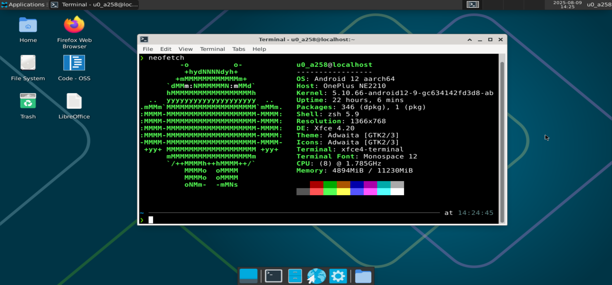
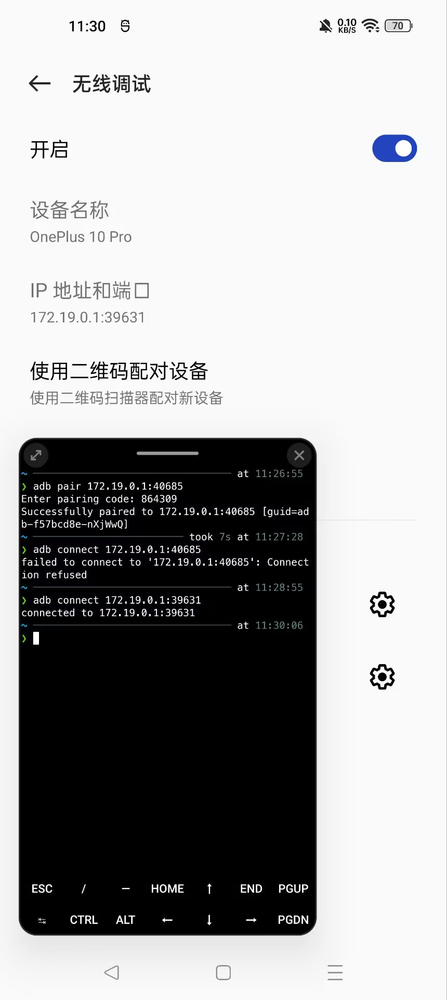
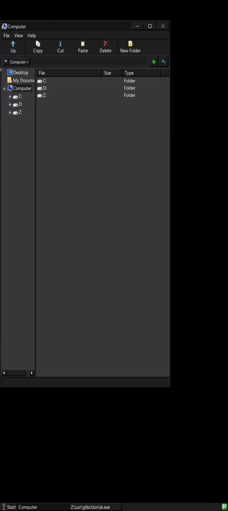
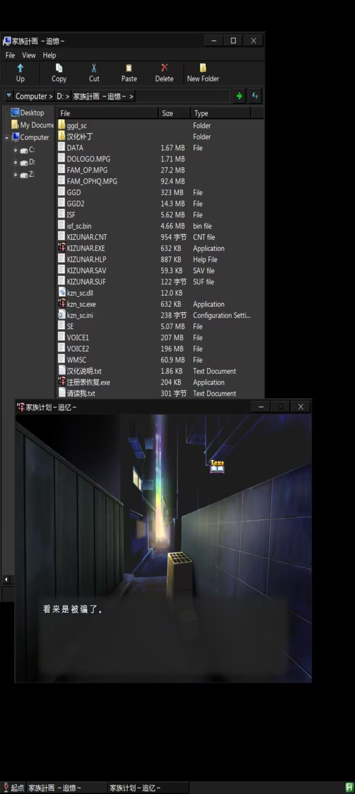

|

#######################################
记录 Termux 折腾过程
#######################################

.. raw:: html
  
  

  

    
    日记残念
    
    SH_Youth
    
    2025.08.09
  

|

上回说到我捡回了一部二手的一加 10 Pro，为何偏偏捡了这个型号，其实还有一层原因，即它有 USB3.0 的接口，这意味着它可以通过这个 Tpye-C 输出视频。使用 Termux 搭建一个桌面环境，接上显示器键鼠后就一定程度上可以当作电脑来用🥰。

========================================
什么是 Termux
========================================

Termux 是一个在 Android 上运行的类 Linux 环境，提供了一个终端模拟器和一套基本的 Linux 工具包。你可以通过其在 Android 设备上安装和运行各种熟悉的 Linux 命令和工具，获得类似于在传统的 Linux 发行版上操作体验。

========================================
Termux 的安装
========================================

直接先把 Termux 装上先，可以在 `Github Releases <https://github.com/termux/termux-app/releases>`_
上找到最新的版本（ ``0.118.0`` 之前的版本可能要到
`GitHub Build Action <https://github.com/termux/termux-app/actions/workflows/debug_build.yml?query=branch%3Amaster+event%3Apush>`_ ）

顺便再先把 `Termux-x11 <https://github.com/termux/termux-x11/releases>`_ 装上，这个是 Termux 的 X11 服务器，可以让你在 Termux 中运行图形界面应用。

========================================
Termux 的配置
========================================

打开 Termux 后，首先要更新一下包管理器和安装一些基本的工具：

----------------------------------------
换源并更新升级软件包
----------------------------------------

键入 ``termux-change-repo`` 命令，选择你所在地区的源，然后更新软件包列表并升级一下：

.. code:: bash

    pkg update && pkg upgrade

----------------------------------------
安装基本工具
----------------------------------------

先装上几个常用的工具：

.. code:: bash

    pkg install git curl wget

再装个 Zsh 美化一下我们的终端：

.. code:: bash

    pkg install zsh

然后可以把 Zsh 设置为默认的 shell：

.. code:: bash

    chsh -s zsh

再把 Oh My Zsh 装上：

.. code:: bash

    sh -c "$(curl -fsSL https://raw.githubusercontent.com/ohmyzsh/ohmyzsh/master/tools/install.sh)"

然后换上一个好看的主题，比如 Powerlevel10k：

.. code:: bash

    git clone --depth=1 https://gitee.com/romkatv/powerlevel10k.git $ZSH_CUSTOM/themes/powerlevel10k

装上自动补全和语法高亮的插件：

.. code:: bash

    git clone https://gitee.com/zsh-users/zsh-autosuggestions $ZSH_CUSTOM/plugins/zsh-autosuggestions

    git clone https://gitee.com/zsh-users/zsh-syntax-highlighting $ZSH_CUSTOM/plugins/zsh-syntax-highlighting

打开 ``~/.zshrc``：

.. code:: bash

    nano ~/.zshrc

然后再其中这两项添加以下内容设置主题及插件：

.. code:: bash

    ZSH_THEME="powerlevel10k/powerlevel10k"

    plugins=(git zsh-autosuggestions zsh-syntax-highlighting)

保存并退出，然后重新加载配置：

.. code:: bash

    source ~/.zshrc

然后根据指引配置 Powerlevel10k 主题即可，如果想要更改配置，可以随时运行 ``p10k configure`` 来重新配置。

--------------------------------
访问手机内部存储
--------------------------------

要在 Termux 中访问手机的内部存储的文件，执行 ``termux-setup-storage`` 命令，授予 Termux 访问存储的权限。这样会在 Termux 的 home 目录下创建一个 ``storage`` 目录，里面包含了对手机存储的访问链接。这样就可以方便地在手机存储和 Termux 之间进行文件操作了。

================================
安装图形化界面
================================

如果你想在 Termux 中获得图形化界面，可以使用 Termux-x11 或 VNC。我选择 Termux-x11。

--------------------------------
安装 Termux-x11 相关包
--------------------------------

Termux-x11 的 app 刚才已经装好了，现在需要安装一些相关的包来支持图形化界面：

.. code:: bash

    pkg install x11-repo
    pkg install termux-x11-nightly

--------------------------------
安装 Xfce4 桌面
--------------------------------

Xfce4 是一个轻量级的桌面环境，适合在 Termux 中使用：

.. code:: bash

    pkg install xfce4

================================
启动图形化界面
================================

--------------------------------
启动 Xfce4 桌面
--------------------------------

首先启动 termux-x11：

.. code:: bash

    termux-x11 :0 &

其中 ``:0`` 是显示器的编号，可以根据需要更改，这里就选 ``0``; ``&`` 是为了让它在后台运行。

接着设置环境变量：

.. code:: bash

    export DISPLAY=:0

然后启动 Xfce4 桌面：

.. code:: bash

    startxfce4 &

然后就可以在 Termux:x11 的应用中看到 Xfce4 桌面了。

.. admonition:: 设置 Termux-x11
    :class: tip

    在启动时，你可以通过长按 Termux:x11 的图标并点 **Preferences** 打开设置页面，
    
    也可在未启动时打开 APP 点 **Preference** 进入设置页面。

--------------------------------
编写启动脚本快速启动桌面
--------------------------------

每次启动桌面都要输这一堆命令也挺麻烦的，我们可以编写一个脚本来做这件事情。

.. code:: bash

    cd $PATH
    nano staxfce

键入一下内容：

.. code:: bash

    #!/bin/bash

    termux-x11 :0 &
    export DISPLAY=:0
    sleep 3
    startxfce4 &
    am start --user 0 -n com.termux.x11/.MainActivity

其中，睡三秒等待一下 termux-x11 启动，完了再用 Android 的 Activity Manager 自动打开 Termux:x11

================================
安装 ADB 自己调试自己
================================

有时候电脑不在身边，手机如果支持无线调试的话，可以直接在 Termux 里装个 ADB 来自己调试自己。

.. code:: bash

    pkg install android-tools

在开发者选项中开启无线调试，选择使用配对码连接，可以看到弹出窗口中的配对码和 IP 以及端口，在 Termux 中输入以下命令：

.. code:: bash

    adb pair <IP>:<Port>

然后输入配对码即可。

配对完后可以使用以下命令连接手机：

.. code:: bash

    adb connect <IP>:<Port>

注意这里的 IP 和端口并非刚刚配对时使用的，是无线调试页面显示的 IP 和端口。

================================
保证 Termux 后台安全
================================

在运行 图形化界面时，Termux 是在后台运行的，很容易被系统杀掉。我们要保证 Termux 可以在后台一直安全运行。

--------------------------------
先关掉电源优化
--------------------------------

在手机的设置中找到 **省电优化** 或 **电池优化** 或 **电源优化** 之类的选项，然后找到 Termux 应用，选择 **不优化** 或 **不受限制**。

--------------------------------
再保证子进程不被杀
--------------------------------

如果你再使用 Termux 的时候发现它突然显示 ``[Process completed (signal 9) - press Enter]``，那么这是就是 Android 12 的 Phantom Process killer 干的好事。它强行限制了应用的子进程数量，最大只允许应用有 32 个子进程。

如果你的开发者选项中有 **停止限制子进程** 的选项，那就简单得多，没有就通过 ADB 来设置吧。

运行这个命令把子进程的上限直接拉满：

.. code:: bash

    adb shell device_config put activity_manager max_phantom_processes 65536

为了防止这个配置在未来和 Google 服务器同步的时候在被覆盖掉又变回去，直接永久禁用 DeviceConfig 的同步功能：

.. code:: bash

    adb shell device_config set_sync_disabled_for_tests persistent

================================
为 Xfce 桌面装几个软件
================================

有了图形化的桌面，赶紧装几个软件玩玩。

--------------------------------
安装 FireFox
--------------------------------

先装个浏览器先：

.. code:: bash

    pkg install firefox

在终端中键入 ``firefox`` 即可启动。

当然 xfce 桌面下方也有个打开浏览器的图标，但现在桌面空空如也，右键桌面创建一个 launcher，键入 firefox 选中已经弹出的提示配置就可以了。没有图标可能看着有点难受，打开 firefox 后直接按 ``ctrl`` + ``shift`` + ``i`` 找到图标保存一下，再给 launcher 设置上就好了。

.. image:: img/DA_2-firefoxIcon.jpg
    :alt: 获取 firefox 图标
    :align: center

--------------------------------
安装 VSCode
--------------------------------

其实 termux 上根本没有 VSCode，但是有开源的 TUR 里的 Code-OSS。

先装个 tur-repo 仓库，再装 code-oss：

.. code:: bash

    pkg install tur-repo
    pkg install code-oss

终端中键入 ``code-oss`` 启动，同样也可以再桌面上整个启动器，好消息是这次不用我们自己去找图标了。

================================
用 Proot 进一步模拟 linux 环境
================================

--------------------------------
安装其他 Linux 发行版
--------------------------------

通过 proot，我们可以在 Termux 中模拟出更完整的 Linux 环境，从容运行更多的软件。

而 proot-distro 则可以直接安装不同的 linux 发行版。

.. code:: bash

    pkg install proot proot-distro

让我们看看有那些发行版：

.. code:: bash

    proot-distro list

我们装个 Debian 吧：

.. code:: bash

    proot-distro install debian

进入 Debian：

.. code:: bash

    proot-distro login debian

这样我们就能像在真正的 Debian 系统中操作了。

然而，此时 Debian 其实是不知道你的 x11 桌面的，也就是说我们在 Debian 中是运行不了图形化软件的。

我们先 ``exit`` 退出登录的系统，在登录命令后面加上 ``--shared-tmp`` 参数,与 proot 环境共享 Termux 临时目录：

.. code:: bash

    proot-distro login debian --shared-tmp

登录后再设置环境变量指定显示到编号 ``0`` :

.. code:: bash

    export DISPLAY=:0

---------------------------------
安装 LibreOffice
---------------------------------

我们现在有了 Debian，赶紧整点 Termux 上没有的软件玩玩：

.. code:: bash

    apt update

    apt install libreoffice

在终端中键入 ``libreoffice`` 启动。

---------------------------------
创建启动器快速启动 LibreOffice
---------------------------------

假如我们只想启动 LibreOffice，却又还要先登录 Debian，这么麻烦，我们直接在桌面右键新建一个 launcher。

这次没有弹出的提示配置了，名字图标随意，命令填入：

.. code:: bash

    proot-distro login debian --shared-tmp -- sh -c 'export DISPLAY=:0 && libreoffice'

=================================
用 Mobox 运行 Windows 软件
=================================

MoBox 是一个集成了 Wine 和 box64 附带图形界面的强大工具，使得我们可以很简单方便地在 Termux 上运行 Windows 软件。

---------------------------------
安装 Mobox
---------------------------------

下载安装脚本并安装：

.. code:: bash

    curl -s -o ~/x https://raw.githubusercontent.com/olegos2/mobox/main/install && . ~/x

开始时它会给出两个选项，选第二个 wow64 的就好了，方便运行 x86 的程序。

完了在终端键入 ``mobox`` 启动。设置先不管了，直接 ``Start Wine`` 就进入了它的图形化界面。

如果此时你还开着 xfce 桌面，你会发现 mobox 的桌面将 xfce 桌面给覆盖了，如果想要 mobox 作为窗口融入 xfce，可以通过修改配置 ``/data/data/com.termux/files/usr/glibc/opt/scripts`` 下的 ``start-tfm`` 文件实现，但一般我们也不需要同时使用这两个桌面增加开销。

现在我们就可以在其中安装和运行 Windows 应用程序了，先随便玩个游戏看看：

.. raw:: html

   

           
           
   

|

发现中文全都无法显示，参考这个 `issue <https://github.com/olegos2/mobox/issues/362>`_ 解决。

|

======================================
参考 References
======================================

这篇文章的内容很大程度来自：

https://linux.do/t/topic/270578

https://www.bilibili.com/video/BV15J4m1g7MW

感谢他们的分享🙏

如我有什么语焉不详的地方，可从他们的文章或视频中找到更详细的解释。