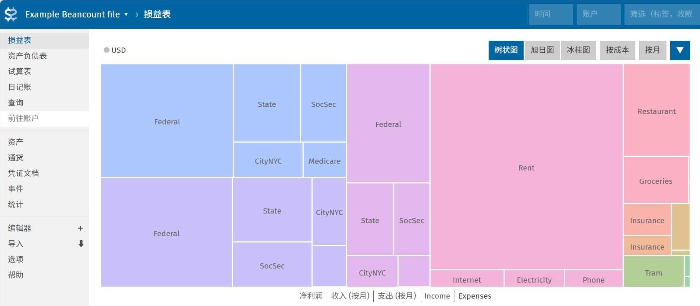

|

#######################################
从 hledger 转向 Beancount
#######################################

.. raw:: html
  
  

  

    
    日记残念
    
    SH_Youth
    
    2026.07.08
  

.. image:: https://moe-counter.saihentai.qzz.io/blog-daily-3/
   :alt: 访问量统计
   :align: right

|

*Beancount: Double-Entry Accounting from Text Files.*

.. admonition:: 前言
    :class: note

    书接上回: `记录我开始使用 hledger 记账 <../../Tech/hledger/index.html>`_

    前略，这里记录一下我从 hledger 转向 Beancount 的过程。

================================
安装 Beancount
================================

不知道为什么，官方文档里好像不推荐使用 ``pip`` 来安装 Beancount，而是说：“By far the easiest way to run beancount in 2026 is via uv”。那就找他说的用 ``uv`` 来安装吧：

.. code-block:: bash

    uv tool install beancount

顺便把 ``fava`` 这个 web 前端也安装了：

.. code-block:: bash

    uv tool install fava

========================================
将 hledger 账本转换为 Beancount 账本
========================================

我本以为这个还挺麻烦的，没想到 hledger 有现成的转到 Beancount 的功能，只需要在命令行中执行：

.. code-block:: bash

    hledger print -o tmp.beancount

注意这里输出的文件名后缀一定要是 ``.beancount``， ``.bean`` 都不行，只要是 ``.beancount`` 后缀 hlegder 才会把账本转换为 Beancount 格式，不然都知识打印到文件里。

但当然并没有那么简单，转换后的 Beancount 账本中有很多问题需要手动修改，首先是默认货币单位的问题，hledger 默认的货币单位我为了省事直接就设成没有单位了，然后在转换后它给我自动分配了成了 ``C``。这个也没什么，让 AI 写了个小脚本把所有作为通货单位的 ``C`` 都替换成了 ``CNY`` 就好了。此外还有一些问题这里暂且按下不表，等后面研究 beancount 的一些与 hledger 不同的特性的章节结束后再说。

=================================
安装 VSCode 的 Beancount 插件
=================================

在之前用 hledger 的时候，hledger 的 ``hledger add`` 命令可以很方便地直接在命令行里添加交易，账户名什么的都可以很方便地按 tab 补全，而且还可以根据交易描述将上一次类似的交易的内容作为预定的默认值，日常开销基本上一路 tab 就改几个数字就好了，非常方便。

我原以为这一切都是理所当然的，现在转到 Beancount 之后，发现并非如此。Beancount 提供的命令行工具基本上都是用来分析账本的，好像没什么用。这时我才意识到，原来 Beancount 的编辑原来就是完全靠文本编辑器来完成的。

所以我就装了个 VSCode 的 Beancount 插件，然而装好之后我发现：这么这个插件只有语法高亮和一些最简单的指令的 snippet，账户名补全什么的都没有。我一开始还真以为这个插件功能就这么简陋了，然后又觉得不应该如此啊。后来思考为什么就更具体账本相关的补全没有呢？然后看到设置里 ``python3 path`` 的设置项。原来这个插件是好像可能应该是通过一个 python 脚本调用 Beancount 库来实现读取账本文件的信息的，而我是用 ``uv`` 虚拟环境安装的 Beancount，主 python 环境下没有安装 Beancount。

用这个命令找到 ``uv tool`` 为 beancount 创建的 Python 路径：

.. code-block:: bash

    uv tool dir

到这里找到 ``beancount\Scripts`` 里面应该就有我们要找的 python 可执行文件了，复制这个路径到 VSCode 的 Beancount 插件的设置里，重启 VSCode 即可。

=================================
Beancount 的一些语法
=================================

Beancount 的账户名比起 hledger 来说更严格，hledger 的账户名可以是任意的字符串，而 Beancount 的账户名必须是以大写字母或数字开头，所以要用中文的账户名的话就必须在账户名的开头加上一个大写字母或数字。

关于货币的单位，必须是全大写的字母，不可以用货币符号（如 ``¥``、``$`` 等）来表示货币单位。这里说是货币，其实可以说一切你想记录的东西，常见的诸如股票、基金，不常见的比如超市的会员卡积分其实都是一样的没什么区别，所以之后就不说货币这个一目了然的词了，而是改用通货这个听起来更高大上，感觉上更通用的词。

不同于 hledger，Beancount 的账户在使用前必须先声明开户，而通货的单位无需声明可以直接用。关于如何声明，这就要用到指令（Directives）了。

---------------------------------
指令 Directives
---------------------------------

Beancount 是一种声明式语言。指令的声明顺序并不重要，在解析之后和处理之前，条目会按时间顺序重新排序。

除交易外，每条指令都假定发生在每天的开始。所以可以在账户第一条交易的同一天声明账户开户，但如果要关闭账户不能在同一天声明账户关闭。

+++++++++++++++++++++++++++++++++
开启账户 Open
+++++++++++++++++++++++++++++++++

正如前文所说，不同于 hledger，Beancount 的账户在使用前必须先声明开户。声明账户开户的指令是 ``open``，语法如下：

.. code-block::

    YYYY-MM-DD open Account [ConstraintCurrency,...] ["BookingMethod"]

其中以逗号分隔的可选约束通货单位列表，约束通货单位是指该账户只能使用这些通货单位进行交易。约束通货单位列表可以为空，表示该账户可以使用任意通货单位进行交易。

另一个可选参数 ``BookingMethod``，感觉没什么用，我就不管了。

++++++++++++++++++++++++++++++++
关闭账户 Close
++++++++++++++++++++++++++++++++

与开户相对的，关闭账户的指令是 ``close``，语法如下：

.. code-block::

    YYYY-MM-DD close Account

虽然不关也不会怎么样，但如果你确定已经不用它了，那应该也不想在报告中在总是看到这个空的账户，所以还是关闭它吧。

+++++++++++++++++++++++++++++++++
声明通货 Commodity
+++++++++++++++++++++++++++++++++

虽然说通货不需要声明可以直接写，但还是有一个声明通货的指令 ``commodity``，语法如下：

.. code-block::

    YYYY-MM-DD commodity Currency

其实没什么用，唯一的用处是为通货附加特定的元数据字段，以便以后由插件收集，比如：

.. code-block::

    1867-07-01 commodity CAD
    name: "Canadian Dollar"
    asset-class: "cash"

    2012-01-01 commodity HOOL
    name: "Hooli Corporation Class C Shares"
    asset-class: "stock"

如果不用的话那就是没什么用。

+++++++++++++++++++++++++++++++
交易 Transactions
+++++++++++++++++++++++++++++++

终于到最主要的指令了，交易的指令是 ``transaction``，语法如下：

.. code-block::

YYYY-MM-DD [txn|Flag] [[Payee] Narration] [tag]
    Account Amount [{Cost}] [@ Price]
    Account Amount [{Cost}] [@ Price]
    ...

看起来超长，一点点看的话，最前面的日期是一样的没什么好说，后面的关键字 ``txn`` 是可选的，因为交易指令太常见了，就说基本上都是交易指令，所以不写也可以。 ``Flag`` 也是可选的，表示交易的标记， ``*`` 表示已完成， ``!`` 表示未完成。例子：

.. code-block::

    2014-05-05 txn "Cafe Mogador" "Lamb tagine with wine"
    Liabilities:CreditCard:CapitalOne         -37.45 USD
    Expenses:Restaurant

    2014-05-05 * "Cafe Mogador" "Lamb tagine with wine"
    Liabilities:CreditCard:CapitalOne         -37.45 USD
    Expenses:Restaurant

^^^^^^^^^^^^^^^^^^^^^^^^^^^^^^^^^^^
Payee & Narration  收款人和说明
^^^^^^^^^^^^^^^^^^^^^^^^^^^^^^^^^^^

紧接着的就是 ``Payee`` 和 ``Narration``，分别表示交易的付款方和交易的说明。 ``Payee`` 是可选的， ``Narration`` 也是可选的。你可以向上面的例子一样把两个字符串都写上，也可以只写一个，只写一个的话默认是 ``Narration``。毕竟写收款方挺奇怪且麻烦的。如果你只想写 ``Payee`` 而不写 ``Narration``，那得在 ``Payee`` 后面加上一个空字符串 ``""`` ，虽然大概率不会这样写的。

^^^^^^^^^^^^^^^^^^^^^^^^^^^^^^^^^^^
Account Amount 过账
^^^^^^^^^^^^^^^^^^^^^^^^^^^^^^^^^^^

第一行指令后面跟着的几行过账（posting）也是差不多的，比较方便的一点是可以使用 `` ( ) * / - + `` 的算术表达式:

.. code-block::

    2014-10-05 * "Costco" "Shopping for birthday"
    Liabilities:CreditCard:CapitalOne         -45.00          USD
    Assets:AccountsReceivable:John            ((40.00/3) + 5) USD
    Assets:AccountsReceivable:Michael         40.00/3         USD
    Expenses:Shopping

另外可以看到，也是一样的可以省一个 amount 不写的，Beancount 会自动计算出剩余的金额来平衡交易。

^^^^^^^^^^^^^^^^^^^^^^^^^^^^^^^^^^^
Costs & Prices  成本和现价
^^^^^^^^^^^^^^^^^^^^^^^^^^^^^^^^^^^

每一条过账的 ``Amount`` 后面可以跟着一个可选的 ``Cost`` 或者 ``Price``，用来表示成本和现价。

先来看现价，设计到不同通货的兑换的时候就会用到了，比如兑换货币的汇率，或者兑换股票的现价。可以用 ``@`` 来表示单价，用 ``@@`` 来表示总价。例子：

.. code-block::

    2012-11-03 * "Transfer to account in Canada"
    Assets:MyBank:Checking            -400.00 USD @ 1.09 CAD
    Assets:FR:SocGen:Checking          436.01 CAD

    2012-11-03 * "Transfer to account in Canada"
    Assets:MyBank:Checking            -400.00 USD @@ 436.01 CAD
    Assets:FR:SocGen:Checking          436.01 CAD

很快你会意识到，货币之间的汇率、股票的现价、基金的现价等等都是之后会随时间不断变化的，这时候我们关心的将会是这些通货存入账户时的成本（costs）。

在给这些通货指定了成本后，这些通货就是按成本持有的通货了，我们就可以在之后的交易中使用这些通货的成本来计算现价变动的盈亏了，这将在之后记录投资的章节中详细讲述。这里就暂且先简单讲一下成本可以用 ``{}`` 来表示就好了。

比如在下面这个例子中，买入了 10 股 S&P 500 指数基金 IVV，每股成本为 183.07 美元，总成本为 1830.70 美元，而之后卖出这 10 股时的现价为每股 197.90 美元，总现价为 1979.00 美元，卖出时的盈亏为 148.30 美元。

.. code-block::

    2014-02-11 * "Bought shares of S&P 500"
    Assets:ETrade:IVV                10 IVV {183.07 USD}
    Assets:ETrade:Cash         -1830.70 USD

    2014-07-11 * "Sold shares of S&P 500"
    Assets:ETrade:IVV               -10 IVV {183.07 USD} @ 197.90 USD
    Assets:ETrade:Cash          1979.00 USD
    Income:ETrade:CapitalGains  -148.30 USD

^^^^^^^^^^^^^^^^^^^^^^^^^^^^^^^^^^^
平衡交易 Balancing Transactions
^^^^^^^^^^^^^^^^^^^^^^^^^^^^^^^^^^^

然而，复式记账的关键在于会计等式——必须确保每笔交易的过账金额之和为零。那么在有不同通货单位，有成本有价格的情况下又是这么样的呢？

在讲计算的规则之前，先看一个简单明了的例子其实就大致可以理解了：

.. code-block::

    YYYY-MM-DD
    Account       10.00 USD                       -> 10.00 USD
    Account       10.00 CAD @ 1.01 USD            -> 10.10 USD
    Account       10 SOME {2.02 USD}              -> 20.20 USD
    Account       10 SOME {2.02 USD} @ 2.50 USD   -> 20.20 USD

一下是对应的四条过账的计算规则：

1. 如果过账没有成本也没有现价，那就直接是该过账的最终金额。
2. 如果过账只有现价，则现价乘以通货单位数，并使用现价通货，得到该过账的最终金额。
3. 如果过账只有成本，则成本乘以通货单位数，并使用成本通货，得到该过账的最终金额。
4. 如果过账既有成本也有现价，则成本乘以通货单位数，并使用成本通货，得到该过账的最终金额。现价在这里被忽略了，但是他会在价格数据库中生成一个条目，之后的盈亏计算就可以看到用处了。

^^^^^^^^^^^^^^^^^^^^^^^^^^^^^^^^^^^
减少仓位 Reducing Positions
^^^^^^^^^^^^^^^^^^^^^^^^^^^^^^^^^^^

按成本持有的通货，即便是同一通货，如果持有的成本不同，也会被 Beancount 视为不同的。也即，未来的交易如果要卖出/减少这些通货（减仓），必须指定成本，明确到底指的是那一批成本的通货。

有几种不同的方式指定到底要减哪一批通货，可以直接提供成本，也可以提供日期，还可以用标签检索（标签在下一小节讲）：

.. code-block::

    ; 假设建仓如下

    2014-02-11 * "Bought shares of S&P 500"
    Assets:ETrade:IVV                20 IVV {183.07 USD, "ref-001"}
    …

    2014-03-22 * "Bought shares of S&P 500"
    Assets:ETrade:IVV                15 IVV {187.12 USD}
    …

    ; 那么以下这些减仓是明确无误的

    2014-05-01 * "Sold shares of S&P 500"
    Assets:ETrade:IVV               -20 IVV {183.07 USD}
    …

    2014-05-01 * "Sold shares of S&P 500"
    Assets:ETrade:IVV               -20 IVV {2014-02-11}
    …

    2014-05-01 * "Sold shares of S&P 500"
    Assets:ETrade:IVV               -20 IVV {"ref-001"}
    …

    2014-05-01 * "Sold shares of S&P 500"
    Assets:ETrade:IVV               -35 IVV {}
    …

如果匹配到多批通货，多批通货的总和对的上的话那就刚好全减了；但如果匹配到多批通货，但总和不对上，会使用预设的顺序减仓，可以设置为先进先出（FIFO）或者是后进先出（LIFO）。当然要是懒或者确实无所谓的情况下，也可以不指定，那就按先进先出或后进先出的顺序减仓。具体这么设置先进先出还是后进先出，可以通过 Option 设置：

.. code-block::

    option "booking_method" "FIFO"
    ;option "booking_method" "LIFO"

^^^^^^^^^^^^^^^^^^^^^^^^^^^^^^^^^^^
标签 Tags
^^^^^^^^^^^^^^^^^^^^^^^^^^^^^^^^^^^

这个和很多社交平台的哈希标签是类似的，可以设置一个也可以设置多个，当然也可以不要。

.. code-block::

    2014-04-23 * "Flight to Berlin" #berlin-trip-2014
    Expenses:Flights              -1230.27 USD
    Liabilities:CreditCard

    2014-04-23 * "Flight to Berlin" #berlin-trip-2014 #germany
    Expenses:Flights              -1230.27 USD
    Liabilities:CreditCard

^^^^^^^^^^^^^^^^^^^^^^^^^^^^^^^^^^^
链接 Links
^^^^^^^^^^^^^^^^^^^^^^^^^^^^^^^^^^^

链接可以看成是一种特殊的标签，用于将一组交易链接组合起来，比如将一组与特定发票相关的交易组合在一起。

.. code-block::

    2014-02-05 * "Invoice for January" ^invoice-pepe-studios-jan14
    Income:Clients:PepeStudios           -8450.00 USD
    Assets:AccountsReceivable

    2014-02-20 * "Check deposit - payment from Pepe" ^invoice-pepe-studios-jan14
    Assets:BofA:Checking                  8450.00 USD
    Assets:AccountsReceivable

+++++++++++++++++++++++++++++
余额断言 Balance Assertions
+++++++++++++++++++++++++++++

你可以在某个时间点上对某个账户的余额进行断言，以验证该账户的余额与你现实中的钱包里的余额一致。余额断言的语法如下：

.. code-block::

    YYYY-MM-DD balance Account Amount

值得注意的是，余额断言与所有其他非交易指令一样，是在日期的开始进行断言的，而不是在交易之后进行断言的。也就是说，如果你在某个日期上有一个余额断言，那么这个断言会在该日期的所有交易之前进行验证。

如果一个账户里有多种通货，那么分别断言即可：

.. code-block::

    2014-02-05 balance Assets:MyBank:Checking  1000.00 USD
    2014-02-05 balance Assets:MyBank:Checking  2000.00 CAD

余额断言适用于特定通货单位的总和，与成本无关。例如，如果您在一个账户中持有两批成本不同的通货，如 5 HOOL {500 USD} 和 6 HOOL {510 USD}，则下面的余额断言是有效的：

.. code-block::

    2014-08-09 balance Assets:Investing:HOOL     11 HOOL

断言不一定只能断言最下级的子账户，也可以断言父账户的余额，父账户的余额是所有子账户的余额之和：

.. code-block::

    2014-01-01 open Assets:Investing
    2014-01-01 open Assets:Investing:Apple       AAPL
    2014-01-01 open Assets:Investing:Amazon      AMZN
    2014-01-01 open Assets:Investing:Microsoft   MSFT
    2014-01-01 open Equity:Opening-Balances

    2014-06-01 *
    Assets:Investing:Apple       5 AAPL {578.23 USD}
    Assets:Investing:Amazon      5 AMZN {346.20 USD}
    Assets:Investing:Microsoft   5 MSFT {42.09 USD}
    Equity:Opening-Balances

    2014-07-13 balance Assets:Investing 5 AAPL
    2014-07-13 balance Assets:Investing 5 AMZN
    2014-07-13 balance Assets:Investing 5 MSFT

+++++++++++++++++++++++++++++++
填充 Pad
+++++++++++++++++++++++++++++++

填充指令会自动插入一个交易，使随后的余额断言成功。语法如下：

.. code-block::

    YYYY-MM-DD pad Account AccountPad

这听起来很奇怪，看一个例子就知道了：

.. code-block::

    ; Account was opened way back in the past.
    2002-01-17 open Assets:US:BofA:Checking

    2002-01-17 pad Assets:US:BofA:Checking Equity:Opening-Balances

    2014-07-09 balance Assets:US:BofA:Checking  987.34 USD

这可以用在你第一天开始记账的时候，你的账户里已经有钱了，所以你可以直接断言账户有这些钱，但你并没有记录这些钱的来源，这时候就可以用 ``pad`` 来自动生成一条交易，把这些钱的来源记为 Equity:Opening-Balances。

当然也可以手动添加一条交易来达到同样的效果：

.. code-block::

    2002-01-17 * "Opening Balance"
    Assets:US:BofA:Checking  987.34 USD
    Equity:Opening-Balances

+++++++++++++++++++++++++++++++
说明 Notes
+++++++++++++++++++++++++++++++

用来给某个账户在某个时间点上添加一条说明，语法如下：

.. code-block::

    YYYY-MM-DD note Account Description

例子：

.. code-block::

    2013-11-03 note Liabilities:CreditCard "Called about fraudulent card."

++++++++++++++++++++++++++++++++
文档 Documents
++++++++++++++++++++++++++++++++

这个指令可以把外部文档附加到某个账户上，语法如下：

.. code-block::

    YYYY-MM-DD document Account PathToDocument

到时候文件名会在 Web 前端中显示为一个链接，点击就可以打开这个文档了。例如：

.. code-block::

    2013-11-03 document Liabilities:CreditCard "/home/joe/stmts/apr-2014.pdf"

然后可以得到这样的账户层级结构：

.. code-block::

    stmts
    `-- Liabilities
        `-- CreditCard
            `-- 2014-04-27.apr-2014.pdf

所有这些文档可以放在一个统一的路径下，使用 ``option`` 来指定这个路径（路径最后没有斜杠），然后在 ``document`` 指令中使用相对路径来引用这些文档。

.. code-block::

    option "documents" "/home/joe/stmts"

+++++++++++++++++++++++++++
现价 Prices
+++++++++++++++++++++++++++

正如前文所说，现价是指某个通货在某个时间点上的市场价格。现价可以用来计算盈亏，也可以用来计算某个时间点上账户的总价值。所以需要有一个指令来指定某个通货在某个时间点上的现价，语法如下：

.. code-block::

    YYYY-MM-DD price Commodity Price

有了这个指令，就可以在查看你投资账户未实现的盈亏了。

注意这个指令只能指定一天的现价，如果在一天内想记录多次现价变动是做不到的（应该也没有人这么闲吧）。

-----------------------------
选项 Options
-----------------------------

选项给人的感觉就是没有日期的指令，一般格式为：

.. code-block::

    option Name Value

有几个选项在前面也已经出现过了，感觉其他的好像也没什么用，有一个可能有用的选项是指定默认的通货单位：

.. code-block::

    option "operating_currency" "CNY"

可以指定多个默认通货单位。指定默认通货单位唯一的用处可能就是在报告的时候尽可能以默认通货单位来显示吧。

可以用 ``bean-doctor list-options`` 来查看所有的选项。

-----------------------------
插件 Plugins
-----------------------------

就是加载一些 Python 模块的插件，语法如下：

.. code-block::

    plugin ModuleName StringConfig

插件的名称应与 PYTHONPATH 中的 Python 模块名称相同，且可以选择接受一些配置参数，参数也是字符串。

-----------------------------
导入 Include
-----------------------------

当账本很大时可以分成好几个文件，在主文件中可以导入其他文件，语法如下：

.. code-block::

    include "path/to/include/file.beancount"

可以说绝对路径也可以是相对路径。

==============================
使用 Beancount 记录投资
==============================

前面在讲成本和现价的时候其实就已经有点意思了，买入时成本和现价是一致的，但之后现价会随时间不断变化，而成本是固定的，由此便有盈有亏。

看这样一个简单的例子，我们在 2017-05-01 买入了 10 股 LeMU，当时的成本和现价都是 1.00 CNY，之后在 2034-05-01 的现价变成了 119.00 CNY，此时我们清仓卖出，卖出时的现价是 119.00 CNY，而成本是 1.00 CNY，所以我们在这笔交易中赚了 1180.00 CNY。

.. code-block::

    2017-05-01 * "Bought shares of LeMU"
    Assets:Investing:LeMU                 10.00 LeMU {1.00 CNY}
    Assets:Cash                          -10.00 CNY

    2034-05-01 * "Sold shares of LeMU"
    Assets:Investing:LeMU                -10.00 LeMU {1.00 CNY} @ 119.00 CNY
    Assets:Cash                         1190.00 CNY
    Income:Investing:PnL               -1180.00 CNY

不难发现，卖出时如果仅看现价的账其实是不平的。三项过账的最终金额之和为 -10.00 * 119.00 CNY + 1190.00 CNY - 1180.00 CNY = -1180.00 CNY，即不能记录这次交易的盈亏。hledger 就是这样的，只有价格的概念，没有成本的概念，导致记录投资时相当别扭。而 Beancount 中有成本，不同成本的通货被视为不同的通货，所以在卖出时可以指定成本（你手头如果有多批不同时间不同成本买入的通货，当一批相同成本的通货数量不够卖出的数量时，如果你很勤快不依靠先进先出或是后进先出，你可以自己在一次交易中写多条过账分别记录不同成本的通货各自减少了多少），这样就可以记录盈亏（Profit and Loss）了。

如果 LeMU 分红了，那该怎么记录呢？

.. code-block::

    2034-05-01 * "LeMU Dividend"
    Assets:Cash                          10.00 CNY
    Income:Investing:Dividends          -10.00 CNY

现金分红没什么好说的了，如果时股份分红/分红再投资呢？

.. code-block::

    2034-05-01 * "LeMU Dividend Reinvested"
    Assets:Investing:LeMU                  1.00 LeMU {119.00 CNY}
    Income:Investing:Dividends

这里我们注明了成本为 119.00 CNY，这咋看好像不对啊，这分红相当于是平白无故得到的，成本不应该是 0 吗？这样假设未来涨到 200.00 CNY 的时候卖出，我们应该是净赚 1.00 * (200.00 - 0) = 200.00 CNY，而不是净赚 1.00 * (200.00 - 119.00) = 81.00 CNY 吧？

其实前者的问题在于，这样看卖出的时候确实很清楚的看到我们就是平白无故得到 1 股然后以 200 块的价格卖出去净赚 200 块，但是别忘了在我们记录分红的时候已经记录了一笔收入了哦： ``Income:Investing:Dividends``。这里我们省略了 amount，但实际上 amount 就是 -119.00 CNY，这笔收入已经被记录了，所以之后涨到 200 块的时候卖出才又赚了 81 块。

在官方文档中有关于使用 Beancount 记录投资的详细说明：https://beancount.github.io/docs/trading_with_beancount/，其他很多比如通过 ``price`` 指令不断记录现价的变动来计算未实现盈亏等等，我认为很少有人会折腾这个，真要看大家都直接在券商平台或是第三方平台直接看了，本来要记账就挺烦的了，浮盈浮亏还要记那真太折腾了。

暂时先写到这吧，未来还有什么想写下了记录下来的再说吧。