###########################
动漫视频常见的瑕疵/缺陷介绍
###########################

.. admonition:: 编者按

    转自 `(04.01.2016) [VCB-Studio 科普教程 6] 动漫视频常见的瑕疵/缺陷介绍 <https://vcb-s.com/archives/4738>`_
    
    非常好的介绍，详尽而全面。

这篇科普教程本身有两个目的，第一个作为给观众们的科普，讲述一下动漫处理中常见的画面问题，
帮助大家理解每次vcb-s发布帖当中那些技术描述；第二个作为vcb-s内部处理教程的基础部分，
帮助组内组外所有入门压制的新手们了解所面对的“敌人”。

需要注意的是，下文列举的大多数瑕疵，大多数情况下，
是无法修复/无法完全修复/无法不具备破坏力部分修复的。多数瑕疵可修复的程度，
取决于问题的轻重，rippers水准，以及牺牲的有效细节多寡……

.. raw:: html

    

        
            <strong>
                阅读本教程前，强烈建议先理解
                
                    <a style="color: #0000ff;" href="http://vcb-s.com/archives/2726" target="_blank" rel="noopener">教程3</a>
                
                中的内容，并在大屏pc上观看（方便看图）
            </strong>
        
    

**本文中，如果图像看不明显，建议点击单独打开，并缩放到1:1观看。**
放大版图片使用的是临近采样放大到2x倍，相当于一个像素放大到2×2倍大小，方便大家理解。

.. raw:: html

    

        <strong>
            
                本教程中所有图例，除非有说明，否则均来自于动漫蓝光原盘截图。
            
        </strong>
    

============================
色带(banding/color banding)
============================

色带是出现频率最多的瑕疵，没有之一。色带产生的原因是精度不足。
因为几乎100%的片源采用YUV 8bit编码，而这种编码是不足以达到可视范围精度的极限，
所以编码本身的瓶颈，决定了从制作到放源，几乎一定会因为精度不足产生色带。

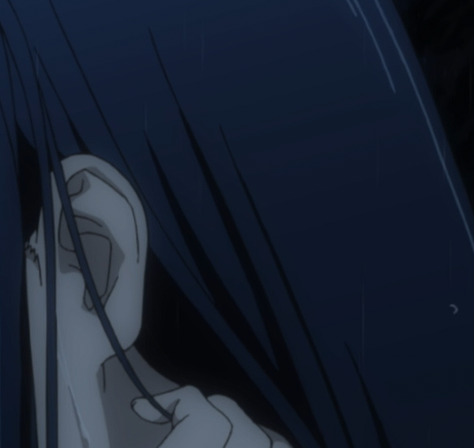

色带的表现大家应该看得多了，颜色在渐变区域表现为波浪状、环状的阶梯型。常见于暗场处。

去色带一般被叫做deband/de-banding

============================
锯齿(aliasing)
============================

锯齿是最典型、最常见的线条部分瑕疵，通常是因为制作分辨率较低，且不规范拉升到更高分辨率造成的：

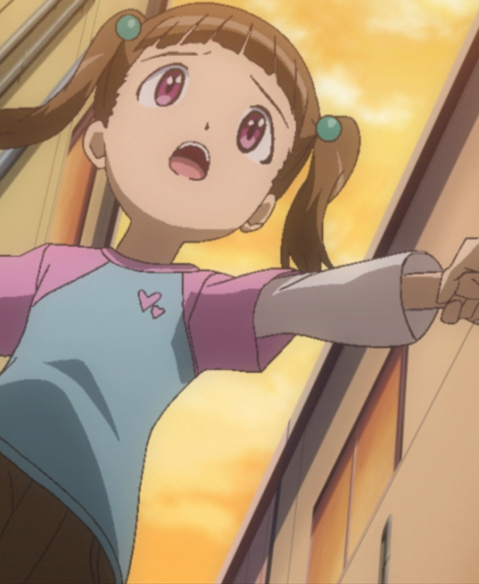

锯齿的处理方式叫做抗锯齿(anti-aliasing, aa)

============================
晕轮/振铃(ringing/haloing)
============================

严格来说这俩是不同的东西，但是表现非常相似，处理时候也通常不区分。
它们也是较为典型的线条瑕疵，通常是因为制作分辨率较低，
且不规范拉升到更高分辨率，且/或 过度锐化造成的：

瑕疵表现为线条周围似乎裹着一层明亮的光晕，如果上图看不出，下图放大版，仔细看线条两侧：

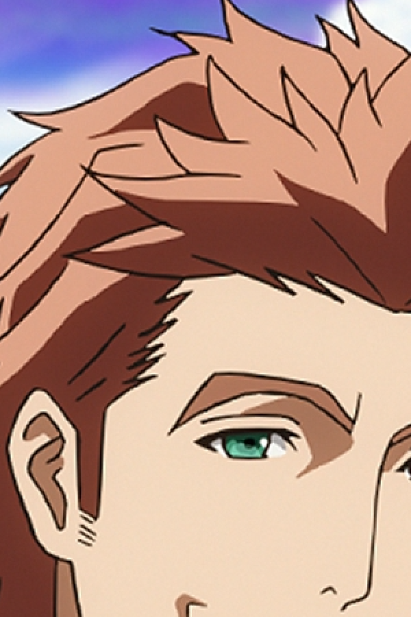

ringing/haloing通常和aliasing是伴生的，这在upscale片源中尤其常见。

播放器拉大、锐化等处理（包括madVR的功能），也很容易出现这两种瑕疵。

ringing/haloing的处理方法叫做去晕轮(dering/de-ringing,  dehalo/de-haloing)

============================
色块(MacroBlock/blocking)
============================

色块一般是严重欠码，或者是视频损坏，导致的图像如网格状凸显，横平竖直:

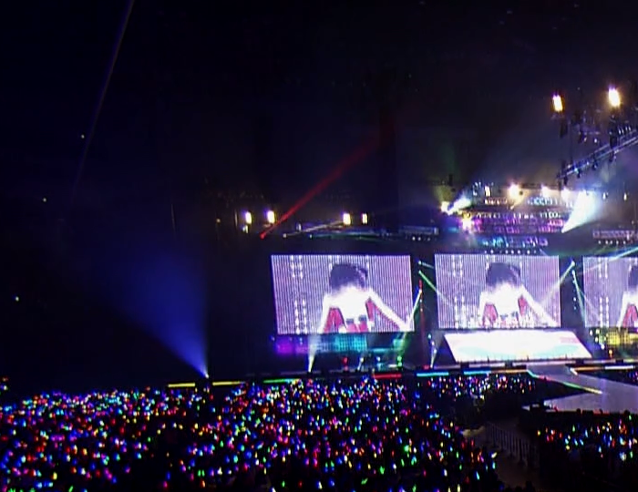

更严重的大家自己去看各种在线视频就好。上图是LL的演唱会蓝光。

色块一般跟色带共生。解决方法称为去色块(deblock/de-blocking)

============================
拉丝/横纹(combing)
============================

拉丝是指图像中相邻两行错位造成的视觉效果：

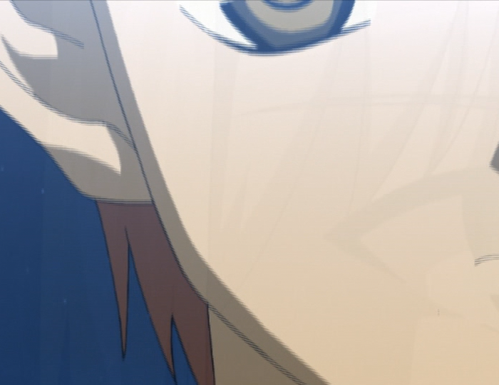

拉丝的产生，一般是原生隔行扫描(interlaced)的片源，没有经过任何处理（或者部分片段漏了处理），然后在逐行扫描(progressive)的设备上（比如pc显示器）播放的结果。

隔行扫描和逐行扫描啥意思啥区别大家不用细究，你只要知道，前者是老技术，后者是新技术，两者之间需要一定步骤做转换，不转换就可能出这种问题。

这玩意是你在任何小白向的压制论坛，见到最多的提问：为啥我压制出来的东西播放有横纹？

根据片源类型的不同，处理方式一般有以下几类：

反交错(de-interlacing)/场匹配(field-matching)/反交卷过带(ivtc)

============================
缟缟(???)
============================

.. note::
    此名称有一定争议，但是vcb-s的发布页看到这个单词，你默认就是下图的效果

缟缟的效果兼具拉丝和锯齿的效果，有其特殊的线条特征：

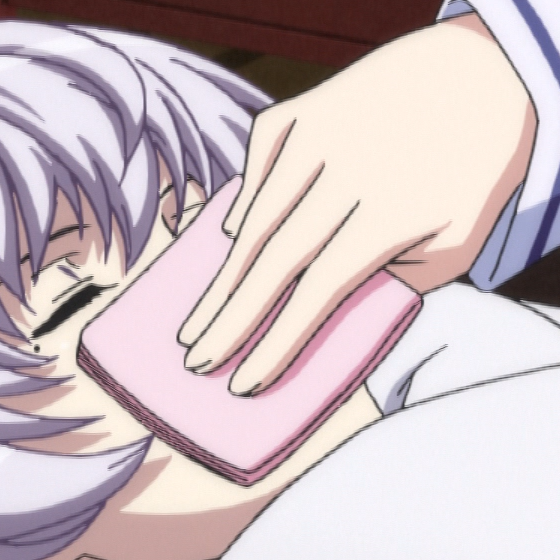

缟缟的产生是隔行扫描的源，没有先转换为逐行扫描，而是在隔行状态下，用逐行扫描的算法放大的结果。

缟缟按照具体表现及程度有不同的处理方法，统称去缟缟。

============================
鬼影(blending/ghosting)
============================

排除掉视频本身采用的特效，这里鬼影指的是非正常的帧融合，造成的动态瑕疵
（图片自制，其实寒蝉的BD挺适合拿来展示，但是当初我下好准备做BDRip，
看了一眼就shift+delete了）：

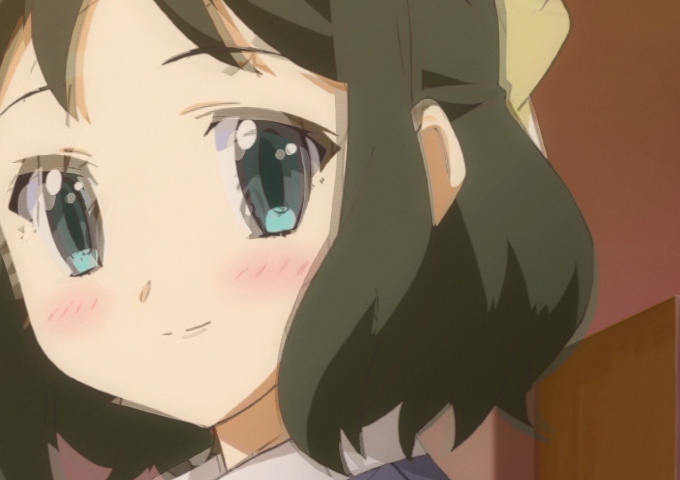

blending一般是不规范的反交错/交卷过带产生，且/或者是滥用不可靠的时域处理造成的。

多数情况下无解（比如寒蝉那BDBOX）；少数有规律可循的，一定手段可以还原。
一般称为de-blending/ghost-removal

====================================
颜色越界（overflow/underflow）
====================================

数字图像处理中，数据如同道路上机动车的速度一样，在规章制度下有着严格的范围限定。
而颜色溢出则是发生了数据在既定规范下上下溢出的问题。典型的如dal的OP：

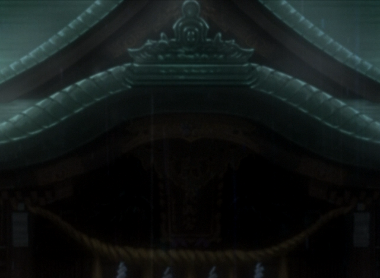

黑咕隆咚的，看我变出点纹理细节来：

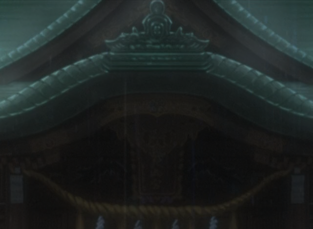

越界的调整一般需要对数字图像规范有着专业的了解，同时还得熟知中间的变换公式。
记为fix overflow/underflow

===========================================================
噪点；彩色噪点/色度噪点（Noise/Grain; chroma noise/grain）
===========================================================

噪点不多介绍了；这里单独贴一下Chroma平面的噪点，往往表现为噪点本身花花绿绿的：

如果你表示看不出啥，加一张去掉上图中色度噪点的：

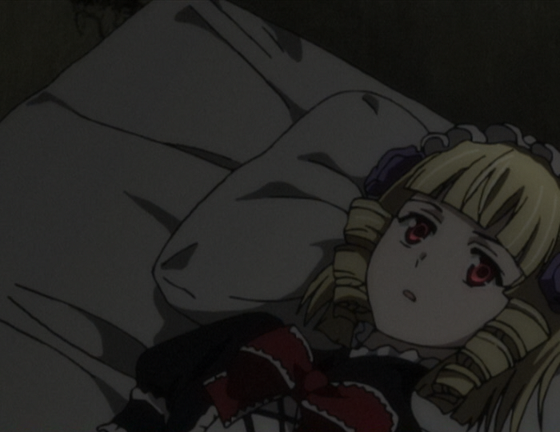

一般来说手段就是降噪(de-noise/de-grain)。

----------------

不讨论特效噪点，就普通数字噪点，降噪本身应该与否，这是被讨论烂的问题。
这里简单说一下我个人的一些看法，注意这是很主观的，完全不是什么“普世价值”：

1. 噪点的重要性低于有效细节，然而，噪点依旧是组成画面的重要部分，
   **在片源噪点明显时候，定位于中/高还原度的BDRip，噪点不应该被一刀切，
   导致源和成品画风突变；**

2. 噪点会消耗大量码率这是不争的事实；因此，
   **越是本身细节丰富动态高的视频，且低码率压制，那么降噪的意义越大，**
   因为可以把有限的码率省下来给真正需要的细节。

3. **降噪会不可避免的损失有效细节，** 特别是暗场处，因此，降噪时候，
   保留有效细节的多寡，是衡量一个ripper降噪水准的重要指标；

4. **降噪应该引入视觉的心理学优化，** 比如说Chroma noise对画风的影响基本是恼人的，
   应该尽可能去掉；亮处的噪点去掉了对画风影响教低，而暗处较高；
   降噪应该在人眼不注意的地方强力，在人眼容易注意的地方较轻，等等。

========================================
烂边/蚊噪(DCT ringing/DCT noise)
========================================

突出一个烂字。是指画面欠码的时候，线条和平面都出现了很脏的观感，
似乎线条被一圈絮絮叨叨的脏东西裹着，而平面有噪点的地方，
噪点烂的很不规律，伴随着色块很难看：

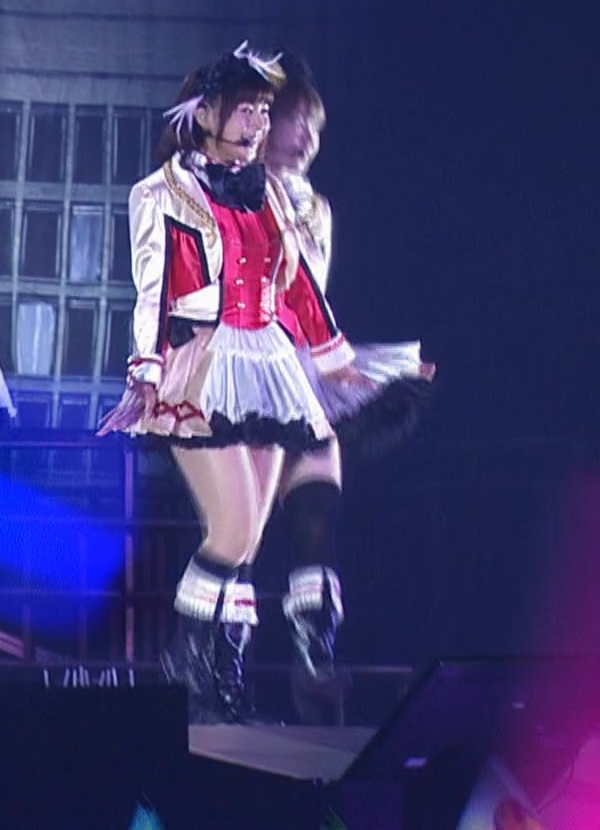

这种瑕疵是因为现在的视频都是基于DCT(Discrete Cosine Transform，离散余弦变换)的编码。
在编码码率严重不足的时候，将一些频率一刀切，就会造成这样的后果。越是早期的视频编码格式越常见。
处理一般要求搭配deband/deblock/denoise进行综合性的处理。

============================
色度色带(Chroma banding)
============================

色度色带，特别指色度平面的精度不足。专门把它拉出来说的原因是，随着SBMV技术普及，
蓝光加噪带来的效果，就是亮度平面精度不足问题削弱，相比较而言，色度平面问题则凸显。
色度色带在目视表现上，跟一般的色带略有区别（下图自制）：

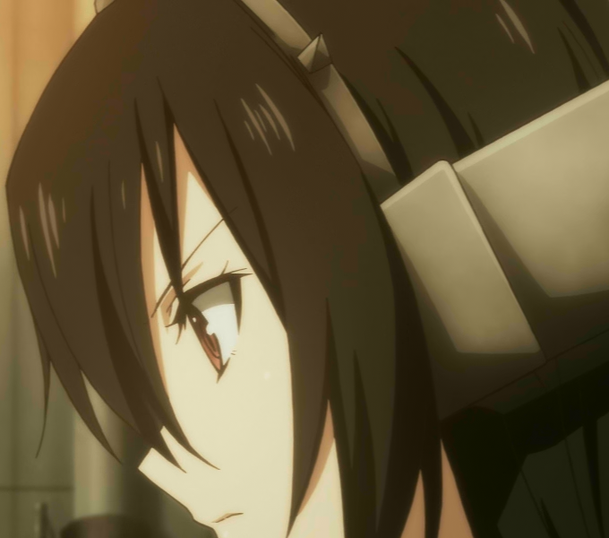

通常来说，表面看不出画面有波浪状的断层，但是颜色过渡很不自然。只有单独拉出UV平面看才发现精度不足：

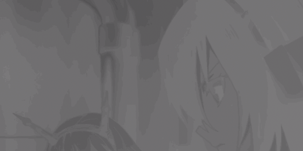

Chroma banding的处理一般随着正常deband的处理，无非是强化UV平面的力度。

============================
色度锯齿(chroma aliasing)
============================

色度锯齿特指色度平面的锯齿，之所以单独说，是因为色度半采样的存在，
导致色度平面经常需要被放大缩小（比如转为RGB处理，再转回去做视频），
如果缩放不规范，就容易造成色度锯齿：

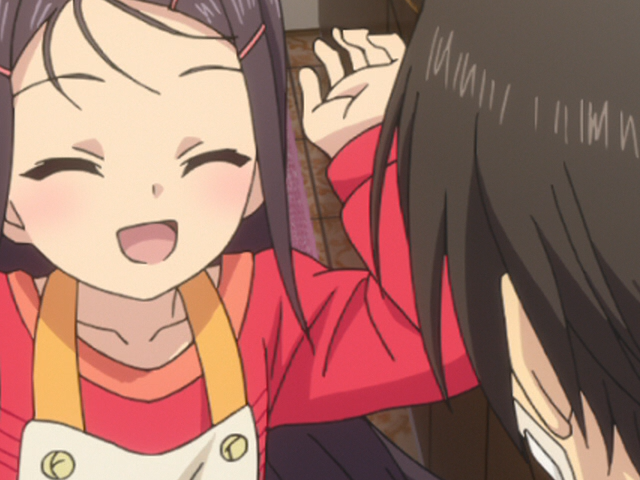

图放大到两倍：

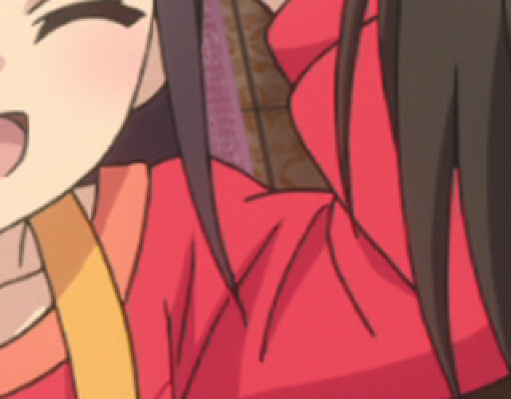

chroma aliasing的处理方式一般是拆分UV平面的抗锯齿(chroma aa)

============================
色度偏移（chroma shift）
============================

色度偏移，指的是色度平面相对亮度平面的错位，通常在极红/蓝/绿/紫处
（这四个地方分别是U/V极大值或者极小值），线条多了一些重影（下图自制）：

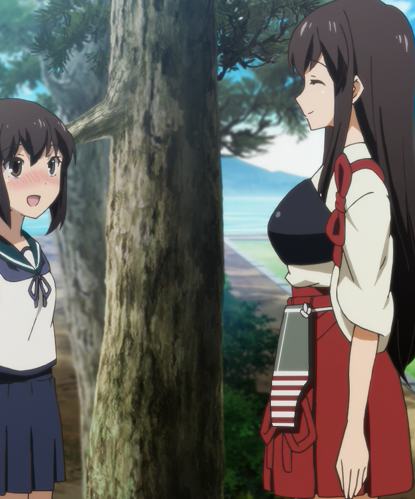

上图是故意将UV左移两个像素。实际蓝光中鲜有这么大尺度的偏移，
最多偏移一个像素，效果非常不明显；一般人很难观察到。

Chroma shift一般发生在数字图像处理中，
不正确处理Chroma placement(Chroma相对Luma的位移)，
造成的后果。修复手段通常叫做fix chroma shift。

============================
色度溢出（chroma bleeding）
============================

色度溢出跟色度偏移很像，区别在于色度偏移是有方向的偏移，
色度溢出是无方向的扩张（找不到更明显的图了；看不出来就算了吧）：

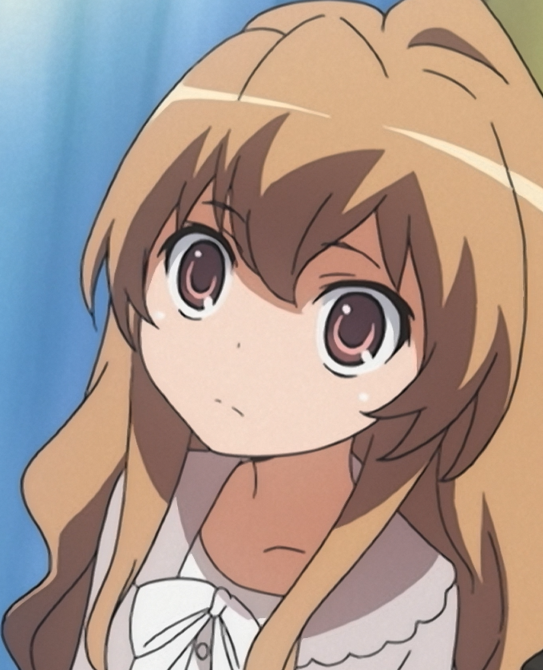

注意上图线条两侧，可以观察到颜色似乎跟周围饱和度不一致。这是轻度的溢出；失控的如下图（自制）：

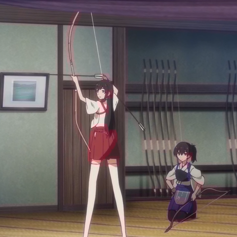

============================
重复场（duplicate field）
============================

重复场表现为一张图，奇数行和偶数行相同。视觉效果如下（轻音少女横滨演唱会；部分动漫中也有，如K的剧场版）：

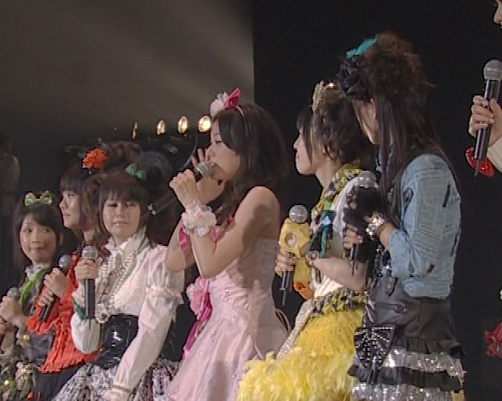

通常和锯齿难以区分；但是如果把奇数行和偶数行拆开各自组成一幅图，把图像一分为二，两份图是一样的。

解决方法就是丢掉奇数行或者偶数行，用剩下的缩放到原来高度。记为fix duplicate field。

=================================
可还原拉升(revertible upscale)
=================================

指的是图像明显是放大而来，而放大的算法，可以被精确或者近似的判断出，然后设计逆向，把图像缩回去：

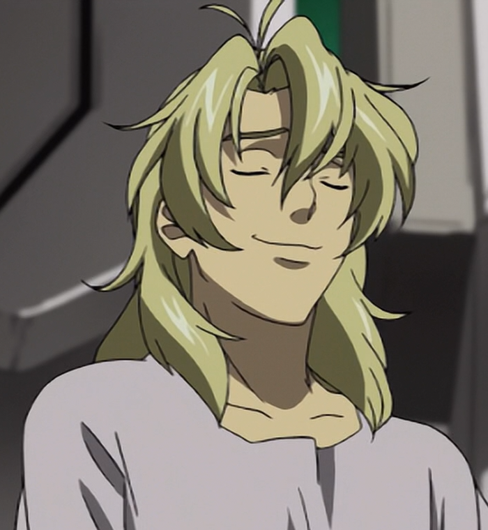

比如这图（局部），线条有大量锯齿，且出现ringing/haloing，
经验丰富的rippers大致可以判断图像是通过类似Bicubic(sharp=-1.0)的算法拉升到1080p的。
那么压制之前就可以根据拉升算法本身数学性质，逆向回720p再处理压制。
这样的处理比一般性降低到720p来的科学。

一般你见到inverse-upscale/de-bilinear/de-bicubic之类的，就说明用了这样的手段。

============================
过度柔化(Over Blurring)
============================

说简单点就是图像太模糊了。本身分辨率低，然后用柔和的算法给拉上来：

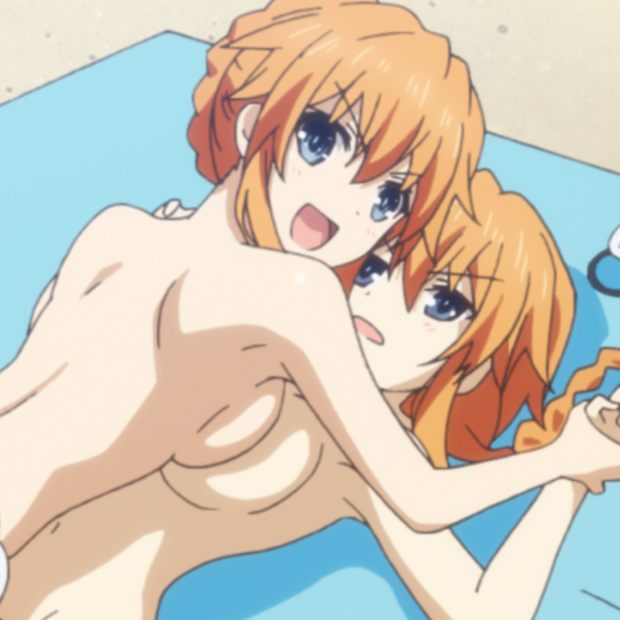

注意这种模糊是全局性的，不是个别镜头/个别位置。一般来说图像还没有锯齿/ringing之类的问题。

处理手段可以是inverse-upscale，拉回低分辨率，也可以采用主动性锐化(active sharpening)。
注意这样的操作属于主观调整。锐化本身是很考验设计的，如何调整强度，设计自适应(adaptive)和保护手段(protective)，
来保证不出现过度锐化的瑕疵（比如锯齿，haloing等），都是学问。

锐化一般分为四种：

* 补偿性锐化（contra-sharp）
    **不属于主观调整** ，目的是补偿一些修复操作中，损失的细节和锐利度，补偿性锐化后的图像看起来不会比源锐利。补偿性锐化更多作为一些修复操作的保护手段，保护细节纹理不受太多损失。

* 可控性锐化（controlled sharp）
    属于主观调整，目的是补偿一些在非极高码率编码下，可能会损失的细节（我知道编码会损失细节，那么在编码之前，我先把容易损失的细节强化一点点，补偿编码的削减），以及在 **不破坏原盘画风的前提下** ，改善细节和纹理观感。往往看源和成品，第一眼看上去没啥区别，特别是线条部分；仔细看才发现，一些细微纹理，成品似乎比源还要清晰点。可控性锐化被中文区raw组不约而同地使用，强度不一。

* 主动性锐化（active sharp）
    属于主观调整，目的是让成品清晰度明显的高于源， **同时几乎不引入过度锐化导致的瑕疵** 。主动性锐化会破坏原盘本身画风，以此换来主观观感的极大提升。典型的比如date a live第二季度，vcb-s和TUC的合作版BDRip。

* 过度锐化（over sharp），
    属于主观调整，相比主动性锐化，结果就是出现大量锯齿/ringing等瑕疵。常见于韩国raw组。

----------------

这几种锐化我个人的态度：

1. 补偿性锐化是画面修复手段，不是主观调整，没有什么争议。

2. 过度锐化非常不可取，与其这样不如让观众自己在播放器里调整。

3. 可控性锐化和主动性锐化，是锐化强度，从量变到质变（是否引起画风明显改变）的过程。因人而异，也很难说到底什么强度算可控，什么强度算主动。

4. 实践证明，在中文区raw组和观众习惯的体积范围(~1GB/集)，可控性锐化利大于弊。强度太低，往往编码造成的损失肉眼可见，画面相比片源明显模糊；强度过高则画风改变明显，让多数观众厌恶。所以各组一般都选择一个适中的强度，最大程度的平衡观众满意度，也让BDRip的细节保留和画面观感，能与2GB/集的BDRip相媲美。这也是BDRip制作中的一种心理学优化。

============================
晃动(Global Motion/pan)
============================

通常是在老片翻新过程中，因为镜头/胶带位置不固定，导致录制的视频，似乎镜头在不断晃动一样，哪怕是应该静止的场景，都有不规律的、小幅晃动

动态图就不找了。大家自己脑补自己拿着手机，边走边录像的效果。

解决方法一般记为depan。

============================
彩虹（rainbow）
============================

Rainbow多出现在早期真人视频中。表现为亮度快速变化的地方，UV似乎像彩虹一般红蓝交织（网上找的图）：

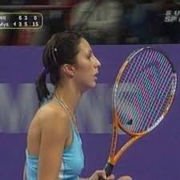

看球拍部位。rainbow的产生是YUV数据作为电磁信号传输过程中，高频的Y信号，因为传输介质不理想，影响到了UV，而产生的后果。如果这时候进行进一步转录，就会把这个问题保留。

B站放的《亮剑》，也有这个问题：战士们背着枪在雪地里走，黑色的枪和白色的雪构成了高频的亮度变化，结果枪身周围出现了红蓝光晕。弹幕一些人吐槽说这枪怎么还带魔法效果……
然而我早已看穿了一切┑(￣Д ￣)┍

修复手段一般称为de-rainbow

============================
点状斑纹(dot-crawl)
============================

点装斑纹也是传输YUV中，不正确处理导致的问题（wiki上的图）：

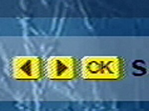

Rainbow和Dot-Crawl在一些上古蓝光，甚至是上古TV源中还能发现它们的存在。高清数字时代之后，特别是动漫，几乎找不到了。

解决方法一般记为 Dot-Crawl removal

----------------

最后，用两对问答来结束本章科普：

问：作为一名ripper，你都干过哪些本末倒置的事情？

答：为了看高清高画质，学习视频修复。

问：作为一名收藏党，你都干过哪些本末倒置的事情？

答：为了省硬盘，逛vcb-s.com。