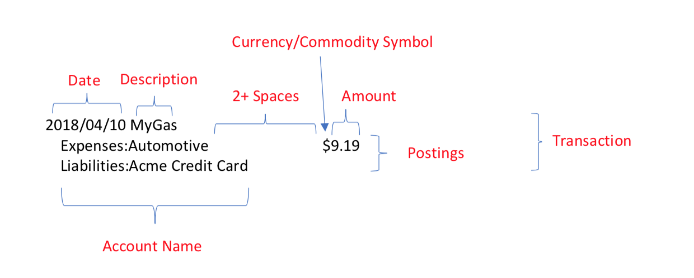

|

#######################################
记录我开始使用 hledger 记账
#######################################

.. raw:: html
  
  

  

    
    科技技术
    
    SH_Youth
    
    2026.06.19
  

.. image:: https://moe-counter.saihentai.qzz.io/blog-tech-1/
   :alt: 访问量统计
   :align: right

|

*hledger is lightweight, cross platform, multi-currency, double-entry accounting software. It lets you track money, investments, cryptocurrencies, invoices, time, inventory and more, in a safe, future-proof plain text data format with full version control and privacy.*

.. admonition:: 前言的前言
    :class: info

    这篇文章写了好久了，是 26 年 3 月写的。本来就是自己边学边记录的，写了一大半后，想着用一段时间后在写完发出来。谁知道一搁置就懒得重新捡起来了。而现在更是等到我都放弃 hledger 了才觉得这篇文章明明都写了一大半了还一直拖着还没放出来。本来预计还要再写一个从其他格式的账本转到 hledger 的 journal 以及从 CSV 导入交易记录的章节，也因为我懒得折腾一直没写（其实是因为我本来就懒得把之前的流水账搬过来）。如今我已经放弃 hledegr 了也无所谓了，这篇文章目前写了什么就放出来吧。
    
    本来我一开始选择 hledger 就是图它简单方便，且可以在命令行很方便的就把账记了。但实际用了一段时间后才越发觉得它实在太过简单，很多需求一开始没意识到，后来才发现它根本没有对应好用的功能。就比如 `关于投资产品的记录`_ 一节里乱七八糟的我到现在都没太弄明白该这么做才好。
    
    还是拥抱 Beancount 吧。

.. admonition:: 前言
    :class: note

    在过去，我主要使用 notion 来记账，就是在 notion 中建一个表格，把每次收支记录成一行，就是所谓的流水账了。还煞有介事地整了不同的表格视图，又是周视图啊又是收支排名什么的，还有一些快速添加条目的按钮，图的话只有一张全部收支的折线图，因为免费账户就只能创建一个图。

    后来我听说了 hledger 这个复式记账工具，花了一点时间折腾了一番，如今写下这段文字。虽是我自己的一个折腾的记录，却以教程的形式写下，是希望今后如有人也要着手使用 hledger 的话能够有所启发。

    你可能会发现有些地方写到好像就是把官方文档翻译了一下，毕竟我懒得自己做示例都是用的官方文档的示例，且我也是照着官方文档学来的，不可避免地讲述顺序和逻辑都如出一辙😟，因为本来就是一半的个人笔记形式的记录，也就不追求什么原创性了，就是官方文档的摘录重排。

=================================
什么是复式记账
=================================

一句话就是：复式记账是指每一笔交易都要记录两条以上的账目，至少包括一个借方和一个贷方。比如说你买了一杯奶茶，花了 10 块现银，那么你就要记录两条账目：

.. code::

  2026-03-01 买奶茶
      expense:food:drinks  10 CNY
      asset:cash          -10 CNY

以此，将资金流动分为 "借方 "或 "贷方"，产生一种错误检查机制，即借方必须与贷方完全平衡，无论是在每笔交易中还是在所有交易中都是如此。

.. code::

  $balance
               -10 CNY  asset:cash
                10 CNY  expense:food:drinks
  --------------------
                     0

更多会计基础知识可以参考 hledger 文档的这篇文章： `Accounting basics for PTA users <https://hledger.org/accounting-pta.html>`_

=================================
快速上手
=================================

---------------------------------
安装 hledger
---------------------------------

  参考：https://hledger.org/install.html

最简单最方便，一条命令快速安装：

.. code:: bash

  # 常用平台安装命令：

  # windows
  winget install -e --id simonmichael.hledger

  # Debian/Ubuntu
  apt install hledger hledger-ui hledger-web

  # Arch Linux
  pacman -Sy hledger hledger-ui hledger-web

  # Homebrew (Mac, Linux)
  brew install hledger

  # docker
  docker pull dastapov/hledger

  # 其他平台和安装方式请参考官方文档：https://hledger.org/install.html

----------------------------------
创建第一个账本
----------------------------------

hledger 的数据文件是一个纯文本文件，默认为 ``~/.hledger.journal``，你也可以在任意目录下创建一个新的账本文件，比如说 ``myjournal.journal``，然后在命令行中使用 ``hledger -f myjournal.journal`` 来指定使用这个账本文件。

如果不想每次都输入 ``-f`` 参数，可以设置环境变量 ``LEDGER_FILE`` 来指定默认的账本文件路径：

.. code:: bash

  # linux/macOS

  echo 'export LEDGER_FILE=~/myjournal.journal' >> ~/.bashrc
  source ~/.bashrc

  # windows (PowerShell)

  [Environment]::SetEnvironmentVariable("LEDGER_FILE", "C:\path\to\myjournal.journal", [System.EnvironmentVariableTarget]::User)

其他方法参考：https://hledger.org/hledger.html#setting-ledger_file

这样以后你就可以直接使用 ``hledger`` 命令来操作你自定义的账本了。当然，如果你不需要改变默认的账本文件路径，也可以直接在 ``~/.hledger.journal`` 中记录你的交易，那就啥也不用做跳过这一步了。

----------------------------------
试着记录第一笔交易
----------------------------------

除了最基本的 cli 输命令的方法，hledger 还提供了简易的 TUI 和 WebUI。TUI 我没有用用过，只是一看就觉得鸡肋，方便不如 cli 直接输入命令来的快，好看不如 WebUI 好看。

我们先来看看 cli 的方法，假设我们今天买了一杯奶茶，花了 10 块现银，那么我们就可以在命令行中输入：

.. code:: bash

  hledger add

然后按照提示输入交易的日期、描述和账目：

.. code:: text

  Date [2026-03-10]:
  Description: 买奶茶
  Account 1: expense:food:drinks
  Amount  1: 10 CNY
  Account 2: asset:cash
  Amount  2 [-10 CNY]:
  Account 3 (or . or enter to finish this transaction):
  2026-03-11 买奶茶
      expense:food:drinks          10 CNY
      asset:cash                  -10 CNY

  Save this transaction to the journal ? [y]: y

WebUI 的方法就更简单了，运行 ``hledger-web``，打开浏览器找到的菜单栏的添加交易的按钮即可，当然还可以按快捷键 ``a`` 添加。

当然当然，你也可以直接使用文本编辑器编辑你的 ``~/.hledger.journal`` 文件，毕竟它就只是一个纯文本文件嘛。

.. code::

  2026-03-10 买奶茶
      expense:food:drinks          10 CNY
      asset:cash                  -10 CNY

----------------------------------
真正记录第一笔交易
----------------------------------

事实上，我们的第一笔交易无论如何肯定不是一个真实的交易，除非你从出生的那一刻开始，一无所有地来到这个世界上就开始记账了，不然你选择任何一天为起点开始记录，你的手头肯定有这个时候初始的资产以及债务。我们需要记录你的初始余额，这样在之后添加交易就可以在初始余额上做加减法，从而方便地得到你的准确账户余额。比如，你的第一笔交易可以写成这样：

.. code::

  2026-03-06 opening balances
      asset:bank:icbc              5000 CNY    ; 初始银行存款 工行
      asset:bank:abc               3000 CNY    ; 初始银行存款 农行
      asset:cash                    500 CNY    ; 初始现金
      asset:card:transit             50 CNY    ; 初始交通卡余额
      asset:investment:stocks     10000 CNY    ; 初始股票投资
      liability:creditcard:icbc   -2000 CNY    ; 初始信用卡欠款 工行
      liability:loan:personal     -5000 CNY    ; 初始个人贷款
      equity                                   ; 这里留空，事实上是因为 hledger 会自动推算留空的条目使得综合为零，这里我们可以偷懒以此完成初始化

一开始我们可以选择近期的某个时间点开始记录，等熟悉后，我们可以在补上更早的交易，并且把第一笔交易的日期改成更早的时间点，这样就可以得到更完整的账本了。如果之前有在其他软件记过帐，也可以直接将之前的账目导出出来，hledger 支持从其他文件（比如常见的 CSV）导入交易，关于这一点，在后面的章节再来讨论。

-----------------------------------
一些小技巧
-----------------------------------

总而言之，现在是快速上手章节，有一些可以让你快速输入交易的小技巧：

1. 使用快捷键：在输入交易时，可以使用一些快捷键来提高效率，比如按 ``Tab`` 键自动补全，这应该是理所应当的了。无论是输入日期还是输入描述还是输入账户名称都可以。

2. hledger 会根据你输入的描述，依据上一次类似描述的交易信息自动推断出你可能要输入的账户名称和交易金额显示再 ``[]`` 中间，你可以按 ``Tab`` 把他召唤出来方便在上一次的基础上小修小改，也可以不做任何修改直接按回车接受 ``[]`` 里面的值。日期也是类似的哦。

.. code:: text

  Date [2026-03-11]:
  Description: 奶茶
  Using this similar transaction for defaults:
  2026-03-11 买奶茶
      expense:food:drinks          10 CNY
      asset:cash                  -10 CNY

  Account 1 [expense:food:drinks]:
  Amount  1 [10 CNY]: 12 CNY
  Account 2 [asset:cash]:
  Amount  2 [-12 CNY]:
  Account 3 (or . or enter to finish this transaction):
  2026-03-11 奶茶
      expense:food:drinks          12 CNY
      asset:cash                  -12 CNY

  Save this transaction to the journal ? [y]:y

=================================
更深入一些来了解如何使用 hledger
=================================

在上一章节的快速入手，我们囫囵吞枣地走马观花了一遍基本操作，肯定还是一头雾水的（因为我当时就是这样的），接下来就从大家最关心的问题开始一个个详细介绍一下以更深入地了解 hledger 的使用方法。

---------------------------------
从细处看交易条目
---------------------------------

这里我复制了 hledger 文档中关于交易条目结构的一张介绍图片，来看看一条交易包含哪些部分。

这条记录记录了 2018 年 4 月 10 日的一笔 9.19 美元的汽车相关支出，用 Acme 信用卡支付。

使用 hledger 记录交易时，我们用的是复式记账，每条交易都要记录下钱的来源和去向，即至少要包含两条以上的账目，至少包括一个借方和一个贷方。每条账目都由一个账户名称和一个金额组成，账户名称由冒号分隔的层级结构组成，金额由数值和货币单位组成（你可以看到图中在数字前面使用了 ``$`` 而我们之前是在数字后面使用 ``CNY``，关于这点将在下面的章节进行讨论）。

在这里，``Expenses:Automotive`` 也是一个账户的名称，虽然可能略有抽象，但它和 ``assets:cash`` 或 ``asset:bank:abc`` 之类的现金或银行账户之类的实体账户一样，只不过是表示支出的一个假想的账户。表示借贷的信用卡 ``Liabilities:Acme Credit Card`` 当然也是一样。

我们用正数表示钱流入账户，用负数表示钱流出账户。所以你可以看到 ``Expenses:Automotive`` 是正的 9.19 美元，即有 9.19 美元流入了支出账户不在属于你，而这笔钱是从你的信用卡流出的。``Liabilities:Acme Credit Card`` 留空即时我们上面说的，为了方便我们可以留空一个金额，hledger 将自动推断出来（比如说上面推断出的是 $-9.19）

-----------------------------------
账户名到底是怎么回事
-----------------------------------

  参考：https://hledger.org/account-names.html

前面叽里呱啦说了一堆，当时账户名这个一串单词加分号的到底是什么玩意儿？（其实猜也能猜到就是老子和儿子的关系嘛。）

账户的名称是随心所欲的。可以大写，也可以不大写；可以是中文，也可以是日文；可以用空格分隔单词，也可以用标点符号分隔。

.. code::

  assets:cash
  Assets:Cash
  资产:现金
  資産:現金
  Assets:Bank of the West
  Assets:Bank-of-the-West
  Assets:Bank_of_the_West
  Assets:BankOfTheWest
  assets:bankofthewest

账户当然也可以有层级结构，层级之间用冒号分隔。层级结构没有限制，可以有任意多的层级，也可以没有层级。例如 ``assets:bank:icbc`` 就是一个三层结构的账户。

.. code::

  assets                  ; top-level account    (depth 1)
  assets:bank             ; second-level account (depth 2)
  assets:bank:icbc        ; third-level account  (depth 3)

分类得以整洁，整洁得以愉悦，没有人会拒绝设计好账户的层级结构使得自己的账本看起来赏心悦目：

.. code:: 

  👇这是啥？
  cash
  checking
  credit card
  starting balances
  gifts received
  salary
  food
  health
  recreation
  rent

  👇好看！
  assets
    bank
    cash
  equity
    start
  expenses
    food
    health
    recreation
    rent
    utilities
  income
    gifts
    salary
  liabilities
    credit card

----------------------------
查看你的账本
----------------------------

问题是，我们哗啦啦地记了一大堆帐，怎么查看它们呢？难道直接打开 ``~/.hledger.journal`` 文件去看吗？下面来看看几种查看账目的方法。

++++++++++++++++++++++++++++
使用 ``print`` 打印所有交易
++++++++++++++++++++++++++++

  参考：https://hledger.org/print-.html

  　　　https://hledger.org/hledger.html#print

``print`` 命令实际上就是把 ``~/.hledger.journal`` 里面的交易记录全部打印出来。

如果你直接打开 ``~/.hledger.journal`` 你会发现它里面的交易记录是根据你添加的先后顺序往下排的，不过 ``print`` 命令会按照时间的先后顺序打印出来。

.. code::

  $ hledger print
  2025-01-01 starting balances
      assets:cash                     100 USD
      assets:bank:checking           1000 USD
      liabilities:credit card        -400 USD
      equity:start

  2025-01-01 pay rent
      assets:bank:checking
      expenses:rent                800 USD

  2025-01-02 salary
      revenues:salary
      assets:bank:checking        1000 USD

  2025-01-03 pay half of credit card balance
      assets:bank:checking
      liabilities:credit card         200 USD

  2025-01-04 shopping
      assets:bank:checking
      expenses:food                200 USD
      expenses:supplies             50 USD

但是这样里面那些贪方便没写的金额还是空的，我们可以加上 ``--explicit`` （ ``-x`` 也是一样的）来显示出它们：

.. code::

  $ hledger print -x
  2025-01-01 starting balances
      assets:cash                     100 USD
      assets:bank:checking           1000 USD
      liabilities:credit card        -400 USD
      equity:start                   -700 USD

  2025-01-01 pay rent
      assets:bank:checking        -800 USD
      expenses:rent                800 USD

  2025-01-02 salary
      revenues:salary            -1000 USD
      assets:bank:checking        1000 USD

  2025-01-03 pay half of credit card balance
      assets:bank:checking           -200 USD
      liabilities:credit card         200 USD

  2025-01-04 shopping
      assets:bank:checking        -250 USD
      expenses:food                200 USD
      expenses:supplies             50 USD

直接 ``print`` 是全部打印出来，那太多了！你也可以做一些过滤。

可以选择只打印某个账户的交易：

.. code::

  $ hledger print expenses:food
  2025-01-04 shopping
      assets:bank:checking
      expenses:food                200 USD
      expenses:supplies             50 USD

也可以通过描述筛选：

.. code::

  $ hledger print desc:rent
  2025-01-01 pay rent
      assets:bank:checking
      expenses:rent                800 USD

可以选择只打印某个时间段的交易：

.. code::

  $ hledger print 2025.01.01-2025.01.04
  2025-01-01 starting balances
      assets:cash                     100 USD
      assets:bank:checking           1000 USD
      liabilities:credit card        -400 USD
      equity:start

  2025-01-01 pay rent
      assets:bank:checking
      expenses:rent                800 USD

  2025-01-02 salary
      revenues:salary
      assets:bank:checking        1000 USD

  2025-01-03 pay half of credit card balance
      assets:bank:checking
      liabilities:credit card         200 USD

  2025-01-04 shopping
      assets:bank:checking
      expenses:food                200 USD
      expenses:supplies             50 USD

可以选择只打印某个时间之后的：

.. code::

  $ hledger print date:2025-01-03..
  2025-01-03 pay half of credit card balance
      assets:bank:checking
      liabilities:credit card         200 USD

  2025-01-04 shopping
      assets:bank:checking
      expenses:food                200 USD
      expenses:supplies             50 USD

也可以选择只打印某个时间之前的：

.. code::

  $ hledger print date:-2025-01-03
  2025-01-01 starting balances
      assets:cash                     100 USD
      assets:bank:checking           1000 USD
      liabilities:credit card        -400 USD
      equity:start
  2025-01-01 pay rent
      assets:bank:checking
      expenses:rent                800 USD
  2025-01-02 salary
      revenues:salary
      assets:bank:checking        1000 USD
  2025-01-03 pay half of credit card balance
      assets:bank:checking
      liabilities:credit card         200 USD

当然还可以是某一天的：

.. code::

  $ hledger print date:2025-01-01
  2025-01-01 starting balances
      assets:cash                     100 USD
      assets:bank:checking           1000 USD
      liabilities:credit card        -400 USD
      equity:start

  2025-01-01 pay rent
      assets:bank:checking
      expenses:rent                800 USD

相信你一定注意到了上面这些例子时间格式千奇百怪，我就是想告诉你这些都可以没有问题：

.. code::

  $ hledger print date:2026-03-04-2026-03-06
  $ hledger print date:2026-03-04..2026-03-06
  $ hledger print date:2026.03.04-2026.03.06
  $ hledger print date:2026.03.04..2026.03.06
  $ hledger print date:20260304-20260306
  $ hledger print date:20260304..20260306
  $ hledger print date:2026-03-06-
  $ hledger print date:2026-03-06..
  $ hledger print date:2026.03.06-
  $ hledger print date:2026.03.06..
  $ hledger print date:20260306-
  $ hledger print date:20260306..
  $ hledger print date:-2026-03-06
  $ hledger print date:..2026-03-06
  $ hledger print date:-2026.03.06
  $ hledger print date:..2026.03.06
  $ hledger print date:-20260306
  $ hledger print date:..20260306
  $ hledger print date:2026-03-06
  $ hledger print date:2026.03.06
  $ hledger print date:20260306

.. hint::

  日期不一定要精确到天，可以只到月份或只是年份。也不一定要指定了年份再指定月日，也不一定要指定了月再指定日。

+++++++++++++++++++++++++++++++++++++++++
使用 ``register`` 显示详细账户流水
+++++++++++++++++++++++++++++++++++++++++

  参考：https://hledger.org/register.html

``register`` 命令也可以打印交易记录，只不过和 ``print`` 相比它是打印成一个表的样子，而且包括交易金额的每一步的运算和：

.. code:: text

  $ hledger register
  2025-01-01 starting balances    assets:cash                100 USD       100 USD
                                  assets:bank:checking      1000 USD      1100 USD
                                  li:credit card            -400 USD       700 USD
                                  equity:start              -700 USD             0
  2025-01-01 pay rent             assets:bank:checking      -800 USD      -800 USD
                                  expenses:rent              800 USD             0
  2025-01-02 salary               revenues:salary          -1000 USD     -1000 USD
                                  assets:bank:checking      1000 USD             0
  2025-01-03 pay half of credi..  assets:bank:checking      -200 USD      -200 USD
                                  li:credit card             200 USD             0
  2025-01-04 shopping             assets:bank:checking      -250 USD      -250 USD
                                  expenses:food              200 USD       -50 USD
                                  expenses:supplies           50 USD             0

一行就是一个交易记录，表头分别是：

.. code:: text

  date       description          account name         change amount   running total

``register`` 的好处在于，当我们只关心某个或某些账户的交易记录时用起来更方便：

.. code::

  $ hledger register checking
  2025-01-01 starting balances    assets:bank:checking      1000 USD      1000 USD
  2025-01-01 pay rent             assets:bank:checking      -800 USD       200 USD
  2025-01-02 salary               assets:bank:checking      1000 USD      1200 USD
  2025-01-03 pay half of credi..  assets:bank:checking      -200 USD      1000 USD
  2025-01-04 shopping             assets:bank:checking      -250 USD       750 USD

  $ hledger register expenses
  2025-01-01 pay rent             expenses:rent              800 USD       800 USD
  2025-01-04 shopping             expenses:food              200 USD      1000 USD
                                  expenses:supplies           50 USD      1050 USD

.. hint::

  1. 如果你觉得 ``register`` 这个单词太长了你其实也可以直接用 ``reg`` 来代替它：

  .. code:: bash

    hledger reg

  2. 和 ``print`` 一样 ``register``也可以以同样的方式限制时间访问，这里就不在赘述了

++++++++++++++++++++++++++++++
用 ``balance`` 查看账户总额
++++++++++++++++++++++++++++++

  参考：https://hledger.org/balance.html

``balance`` 可以用来查看你的账户的总余额，默认就是打印所有账户的当前余额，但是当然也可以指定某些账户：

.. code:: text

  $ hledger balance
              750 USD  assets:bank:checking
              100 USD  assets:cash
              -700 USD  equity:start
              200 USD  expenses:food
              800 USD  expenses:rent
                50 USD  expenses:supplies
              -200 USD  liabilities:credit card
            -1000 USD  revenues:salary
  --------------------
                    0

  $ hledger balance assets liabilities
              750 USD  assets:bank:checking
              100 USD  assets:cash
              -200 USD  liabilities:credit card
  --------------------
              650 USD  

你可能觉得这样很丑，但是原样输出的化就只能长这样了。不过当你限定了打印的报告的时间间隔之后就可以打印成好看一些的表。

比如你也可以按月份来打印余额报告：

.. code:: text

  $ hledger balance -M
  Balance changes in 2025-01:

                          ||       Jan 
  =========================++===========
  assets:bank:checking    ||   750 USD 
  assets:cash             ||   100 USD 
  equity:start            ||  -700 USD 
  expenses:food           ||   200 USD 
  expenses:rent           ||   800 USD 
  expenses:supplies       ||    50 USD 
  liabilities:credit card ||  -200 USD 
  revenues:salary         || -1000 USD 
  -------------------------++-----------
                          ||         0 

加上 ``--pretty`` 还可以更漂亮：

.. code:: text

  $ hledger balance -M --pretty
  Balance changes in 2025-01:

    ┌─────────────────────────╥───────────┐
    │                         ║       Jan │
    ╞═════════════════════════╬═══════════╡
    │ assets:bank:checking    ║   750 USD │
    │ assets:cash             ║   100 USD │
    │ equity:start            ║  -700 USD │
    │ expenses:food           ║   200 USD │
    │ expenses:rent           ║   800 USD │
    │ expenses:supplies       ║    50 USD │
    │ liabilities:credit card ║  -200 USD │
    │ revenues:salary         ║ -1000 USD │
    ├─────────────────────────╫───────────┤
    │                         ║         0 │
    └─────────────────────────╨───────────┘

还可以按天来打印余额报告：

.. code:: text

  $ hledger balance -D
  Balance changes in 2025-01-01..2025-01-04:

                          || 2025-01-01  2025-01-02  2025-01-03  2025-01-04 
  =========================++================================================
  assets:bank:checking    ||    200 USD    1000 USD    -200 USD    -250 USD 
  assets:cash             ||    100 USD           0           0           0 
  equity:start            ||   -700 USD           0           0           0 
  expenses:food           ||          0           0           0     200 USD 
  expenses:rent           ||    800 USD           0           0           0 
  expenses:supplies       ||          0           0           0      50 USD 
  liabilities:credit card ||   -400 USD           0     200 USD           0 
  revenues:salary         ||          0   -1000 USD           0           0 
  -------------------------++------------------------------------------------
                          ||          0           0           0           0 

就这些还不过瘾，何不加入总计 ( ``-T`` , total) 和均值 ( ``-A`` , average)：

.. code:: text

  $ hledger balance expenses -DTA
  Balance changes in 2025-01-01..2025-01-04:

                    || 2025-01-01  2025-01-02  2025-01-03  2025-01-04     Total  Average 
  ===================++===================================================================
  expenses:food     ||          0           0           0     200 USD   200 USD   50 USD 
  expenses:rent     ||    800 USD           0           0           0   800 USD  200 USD 
  expenses:supplies ||          0           0           0      50 USD    50 USD   12 USD 
  -------------------++-------------------------------------------------------------------
                    ||    800 USD           0           0     250 USD  1050 USD  262 USD 

还可以加个 ``-S`` 排序（sort），加个 ``-%`` 显示金额占每列的百分比：

.. code:: text

  $ hledger balance expenses -DTAS -%
  Balance changes in 2025-01-01..2025-01-04:

                    || 2025-01-01  2025-01-02  2025-01-03  2025-01-04    Total  Average 
  ===================++==================================================================
  expenses:rent     ||    100.0 %           0           0           0   76.2 %   76.2 % 
  expenses:food     ||          0           0           0      80.0 %   19.0 %   19.0 % 
  expenses:supplies ||          0           0           0      20.0 %    4.8 %    4.8 % 
  -------------------++------------------------------------------------------------------
                    ||    100.0 %           0           0     100.0 %  100.0 %  100.0 % 

值得注意的是， ``balance`` 虽然名叫 “balance”，你会发现它实际上默认打印的不是总余额，此时你可以加上 ``-H`` （即 ``--historical``）让它显示余额结果而非余额变化。比如这个打印每日资产和负债变化的例子：

.. code:: text

  $ hledger balance assets liabilities -D
  Balance changes in 2025-01-01..2025-01-04:

                          || 2025-01-01  2025-01-02  2025-01-03  2025-01-04 
  =========================++================================================
  assets:bank:checking    ||    200 USD    1000 USD    -200 USD    -250 USD 
  assets:cash             ||    100 USD           0           0           0 
  liabilities:credit card ||   -400 USD           0     200 USD           0 
  -------------------------++------------------------------------------------
                          ||   -100 USD    1000 USD           0    -250 USD 

  $ hledger balance assets liabilities -DH
  Ending balances (historical) in 2025-01-01..2025-01-04:

                          || 2025-01-01  2025-01-02  2025-01-03  2025-01-04 
  =========================++================================================
  assets:bank:checking    ||    200 USD    1200 USD    1000 USD     750 USD 
  assets:cash             ||    100 USD     100 USD     100 USD     100 USD 
  liabilities:credit card ||   -400 USD    -400 USD    -200 USD    -200 USD 
  -------------------------++------------------------------------------------
                          ||   -100 USD     900 USD     900 USD     650 USD 

如果你想同时看看父子账户的余额，可以用用 ``-t`` 以树形显示账户：

.. code:: text

  $ hledger balance assets liabilities -DHt
  Ending balances (historical) in 2025-01-01..2025-01-04:

                          || 2025-01-01  2025-01-02  2025-01-03  2025-01-04 
  =========================++================================================
  assets                  ||    300 USD    1300 USD    1100 USD     850 USD 
    bank:checking         ||    200 USD    1200 USD    1000 USD     750 USD 
    cash                  ||    100 USD     100 USD     100 USD     100 USD 
  liabilities:credit card ||   -400 USD    -400 USD    -200 USD    -200 USD 
  -------------------------++------------------------------------------------
                          ||   -100 USD     900 USD     900 USD     650 USD 

你可能发现了一些只有一个子账户的折叠起来了，如果看不爽可以用 ``--no-elide`` 强制展开，虽然没有什么用。

另外，可以用 ``--depth [数字]`` 或直接 ``-[数字]`` 限制账户的深度，如 ``-1`` 表示深度为 ``1`` 的账户，即顶级账户：

.. code:: text

  $ hledger balance assets liabilities -DHt -1
  Ending balances (historical) in 2025-01-01..2025-01-04:

              || 2025-01-01  2025-01-02  2025-01-03  2025-01-04 
  =============++================================================
  assets      ||    300 USD    1300 USD    1100 USD     850 USD 
  liabilities ||   -400 USD    -400 USD    -200 USD    -200 USD 
  -------------++------------------------------------------------
              ||   -100 USD     900 USD     900 USD     650 USD 

再日期很多的时候这个表会超级长，如果你的屏幕也超级长当然没问题，如果不是的话，你可以用 ``--transpose`` 交换行和列的位置：

.. code:: text

  $ hledger balance assets liabilities -DHN -1 --transpose
  Ending balances (historical) in 2025-01-01..2025-01-04:

              ||   assets  liabilities 
  ============++=======================
  2025-01-01 ||  300 USD     -400 USD 
  2025-01-02 || 1300 USD     -400 USD 
  2025-01-03 || 1100 USD     -200 USD 
  2025-01-04 ||  850 USD     -200 USD 

（发现了少了什么了吗，原本的总计行不见了，其实是 ``-N`` 做的哦。）

.. hint::

  1. 如果你觉得 ``balance`` 这个单词太长了你其实也可以直接用 ``bal`` 来代替它：

  .. code:: bash

    hledger bal

  2. 和 ``print`` 一样 ``balance``也可以以同样的方式限制时间访问，这里就不在赘述了

  3. 除了 ``-D`` 以外， ``balance`` 还支持按周 ( ``-W`` ) 和按年 ( ``-Y`` ) 来打印余额报告，其他选项和 ``-D`` 是一样的哦。

++++++++++++++++++++++++++++++++++++++++
使用 ``balancesheet`` 查看你的资产与负债
++++++++++++++++++++++++++++++++++++++++

  参考：https://hledger.org/balancesheet.html

有时候我们可能只关心自己的资产和负债情况，这个时候 ``balance`` 就显得杀鸡用牛刀了， ``balancesheet`` 就是专门处理这样的情况的一个更简单更单纯的命令。

.. code:: text

  $ hledger balancesheet
  Balance Sheet 2025-01-04

                            || 2025-01-04 
    =========================++============
    Assets                  ||            
    -------------------------++------------
    assets:bank:checking    ||    750 USD 
    assets:cash             ||    100 USD 
    -------------------------++------------
                            ||    850 USD 
    =========================++============
    Liabilities             ||            
    -------------------------++------------
    liabilities:credit card ||    200 USD 
    -------------------------++------------
                            ||    200 USD 
    =========================++============
    Net:                    ||    650 USD 

``balancesheet`` 和 ``balance`` 一样可以使用上述的参数。像这样，按天树形打印，树深度为 2：

.. code:: text

  $ hledger bs -Dt -2
  Daily Balance Sheet 2025-01-01..2025-01-04

                          || 2025-01-01  2025-01-02  2025-01-03  2025-01-04 
  =========================++================================================
  Assets                  ||                                                
  -------------------------++------------------------------------------------
  assets                  ||    300 USD    1300 USD    1100 USD     850 USD 
    bank                  ||    200 USD    1200 USD    1000 USD     750 USD 
    cash                  ||    100 USD     100 USD     100 USD     100 USD 
  -------------------------++------------------------------------------------
                          ||    300 USD    1300 USD    1100 USD     850 USD 
  =========================++================================================
  Liabilities             ||                                                
  -------------------------++------------------------------------------------
  liabilities:credit card ||    400 USD     400 USD     200 USD     200 USD 
  -------------------------++------------------------------------------------
                          ||    400 USD     400 USD     200 USD     200 USD 
  =========================++================================================
  Net:                    ||   -100 USD     900 USD     900 USD     650 USD 

.. hint::

  1. 同样的，如果你觉得 ``balancesheet`` 这个单词太长了你其实也可以直接用 ``bs`` 来代替它：

  .. code:: bash

    hledger bs

  2. 同样的 ``balancesheet``也可以以同样的方式限制时间访问，这里就不在赘述了

  3. 同样的，除了 ``-D`` 以外， ``balancesheet`` 还支持按周 ( ``-W`` ) 和按年 ( ``-Y`` ) 来打印余额报告，其他选项和 ``-D`` 是一样的哦。不过毕竟是一个时间点的报表，和上面的可以过滤出一个时间段的还是有点差别的。

  4. 虽然可能用不到，但还是姑且提一下， ``balancesheet`` 有一个变体，就是加入 equity 的 ``balancesheetequity`` 简写为 ``bse``。这个报告的一个好处是可以很方便地检查会计等式（A+L+E = 0）是否成立，但前提是你使用 ``close --retain`` 将收入和支出账户的余额转移到 equity 账户里了，否则这个报告就没什么意义了。而这着实是没有什么必要。

  5. ``balancesheet`` 统计你的资产和负债靠的是你的账户名，所以你如果不取类似 ``assets`` 或 ``liabilities`` 之类的名字就统计不到了。

++++++++++++++++++++++++++++++++++++++++++++++
使用 ``incomestatement`` 查看你的收入与支出
++++++++++++++++++++++++++++++++++++++++++++++

  参考：https://hledger.org/incomestatement.html

有了 ``balancesheet`` 查看资产与负债，那么有一个 ``incomestatement`` 查看收入与支出应该是理所当然的吧。它们两个很多都是类似的就不再重复了，看个排序好的带总额和平均值的每日收入支出报表的例子吧：

.. code:: text

  $ hledger is -DSTA
  Daily Income Statement 2025-01-01..2025-01-04

                    || 2025-01-01  2025-01-02  2025-01-03  2025-01-04     Total  Average 
  ===================++===================================================================
  Revenues          ||                                                                   
  -------------------++-------------------------------------------------------------------
  revenues:salary   ||          0    1000 USD           0           0  1000 USD  250 USD 
  -------------------++-------------------------------------------------------------------
                    ||          0    1000 USD           0           0  1000 USD  250 USD 
  ===================++===================================================================
  Expenses          ||                                                                   
  -------------------++-------------------------------------------------------------------
  expenses:rent     ||    800 USD           0           0           0   800 USD  200 USD 
  expenses:food     ||          0           0           0     200 USD   200 USD   50 USD 
  expenses:supplies ||          0           0           0      50 USD    50 USD   12 USD 
  -------------------++-------------------------------------------------------------------
                    ||    800 USD           0           0     250 USD  1050 USD  262 USD 
  ===================++===================================================================
  Net:              ||   -800 USD    1000 USD           0    -250 USD   -50 USD  -12 USD 

.. hint::

  1. 还是那句话，如果你觉得 ``incomestatement`` 这个单词太长了你其实也可以直接用 ``is`` 来代替它：

  .. code:: bash

    hledger is

  2. 还是那句话 ``incomestatement`` 也可以以同样的方式限制时间访问，这里就不在赘述了。

  3. 同样的，除了 ``-D`` 以外， ``incomestatement`` 还支持按周 ( ``-W`` ) 和按年 ( ``-Y`` ) 来打印余额报告，其他选项和 ``-D`` 是一样的哦。

  4. ``incomestatement`` 统计你的收入和支出也是靠的是你的账户名，所以你如果不取类似 ``revenues`` 或 ``expenses`` 之类的名字就统计不到了。像是实测的 ``incomes`` 也是可以统计到 Revenues 里面的，所以取名最好取这些一般来讲大家都这么叫的名字吧。

============================================
更进一步的高级功能和知识
============================================

上面这么一大堆，其实实际上大致就是讲了如何写入账本以及如何读取账本，下面的就是一些除此之外的更进一步的高级的功能或一些其他的知识。

---------------------------------------------
货币的单位与换算
---------------------------------------------

  参考：https://hledger.org/doc.html#multiple-currencies

  　　　https://hledger.org/currency-conversion.html

  　　　https://hledger.org/cost-notation.html

  　　　https://hledger.org/multicurrency-tutorial.html

  　　　https://hledger.org/hledger.html#costs

相信你前面也已经发现了，上文给的例子有的是我自己做的，有的是 hledger 文档里直接拿来的，然后有的例子里货币符号在数字前面，有的例子里货币代码在数字后面。于是就自然的会想到一个问题：如果我有不同币种的交易记录，我该怎么写呢？货币汇率是时时在变的，记账的时候要怎么处理才能平账呢？

首先来看看货币符号或货币代码的问题吧，事实上，hledger 支持在数字前面使用货币符号，也支持在数字后面使用货币符号；支持在数字后面使用货币代码，也还支持在数字前面使用货币代码：

.. code:: text

  $100
  100$
  100 USD
  USD 100
  100

只不过，第一种和第二是等效的，第三种和第四中也是等效的，你在写的时候随便写都行，但是 hledger 打印的时候只会选择你最开始使用的那种写法（写在前面或后面）打印。

另外，你看到第五行没有加单位，这其实是可以的。在 hledger 中，没有单位本身被视作一种单位，或者说无量纲量本身就和有不同单位的量一样的不同。（我听说在 ledger 中可以通过 ``D 1.00 CNY`` 来设置默认货币单位然后就可以在输入时省略了，无论如何 hledger 中显然不是这样的）。于是，一种折中的做法是：反正一般来说正常人基本上都是在一直使用同一种货币的，不想每次记账都写上货币单位，那就自己默认无单位的就是自己最常用或者一直用的 CNY 就完了。

但如果你却是在生活中涉及到了多币种的问题，那就有点麻烦了：

.. code:: text

  2018/11/01
    income:gifts
    assets:bank          1000 R
      
  2018/11/02
    assets:bank
    expenses:food         500 R

  2018/11/03
    income:foss
    assets:liberapay       10 E

  2018/11/04
    assets:liberapay      -10 E
    assets:bank           750 R

.. code:: text

  $ hledger bal  -YE
  Balance changes in 2018:

                      ||         2018 
    ==================++==============
    assets:bank      ||       1250 R 
    assets:liberapay ||            0 
    expenses:food    ||        500 R 
    income:foss      ||        -10 E 
    income:gifts     ||      -1000 R 
    ------------------++--------------
                      || -10 E, 750 R 

交易涉及到了货币的兑换，完了算出来最后不是 0 了🤯！（ ``-E`` / ``--empty`` 是为了像是余额为零的账户，不然会默认隐藏）

有人说，加个参数 ``-B`` / ``-cost`` ，将所有的 amounts 转换成 cost:

.. code:: text

  $ hledger bal -YEB
  Balance changes in 2018:

                    ||         2018 
  ==================++==============
  assets:bank      ||       1250 R 
  assets:liberapay || 10 E, -750 R 
  expenses:food    ||        500 R 
  income:foss      ||        -10 E 
  income:gifts     ||      -1000 R 
  ------------------++--------------
                    ||            0 

好像最后算出来是 0 了，但是本来是 0 的 ``assets:liberapay`` 那一项变成 ``10 E, -750 R``，合着问题并没有解决，只是转移了😅。

到底是什么情况？用 ``print -x`` （x 表示 explicit） 看看 hledger 到底是怎么除了那一条货币兑换的记录的：

.. code::

  $ hledger print -x date:20181104
  2018/11/04
      assets:liberapay    -10 E @@ 750 R
      assets:bank                  750 R

这个 ``@@`` 就是 hledger 的成本记法，意思是说这笔交易的金额是 -10 E，但它的成本（cost）是 750 R。此时在 https://hledger.org/hledger.html#costs 中有所记载。有三种写法：

1. 在金额后面写上单价，就是 ``@ UNITPRICE``:

.. code:: text

  2009/1/1
    assets:euros     €100 @ $1.35  ; one hundred euros purchased at $1.35 each
    assets:dollars                 ; balancing amount is -$135.00

2. 在金额后面写上总价，就是 ``@@ TOTALPRICE``:

.. code:: text

  2009/1/1
    assets:euros     €100 @@ $135  ; one hundred euros purchased at $135 for the lot
    assets:dollars

3. 啥都不写也可以，上面的例子也看到了，heldger 会自动转换成第二种写法，但要注意记账的顺序，不然可能会反过来推断（要的是 ``€100 @@ $135`` 而不是 ``$135 @@ €100``）

.. code:: text

  2009/1/1
    assets:euros     €100          ; one hundred euros purchased
    assets:dollars  $-135          ; for $135

这样做固然很好，但也有人会觉得不爽。因为以严格的复式记账法来看，这样子似乎不同币种根本没有平衡，总有一些币种的货币凭空消失了而另一种币种的货币凭空变出来了。这使得会计等式 Assests = Liabilities + Equity 不成立了，也就使得打印 balance 报告没办法好好显示出最后的总额 0。

由此引出另一种处理方法：使用 ``equity`` 账户添加一个平衡过账：

.. code:: text

  2021-01-01
      assets:cash        -100 EUR
      equity:conversion   100 EUR
      equity:conversion  -120 USD
      assets:cash         120 USD

但这样做的坏处也是不言而谕的，本来清晰明了的转换过程被藏得严严实实，啰里啰唆的。

还有一种二者兼之的无敌复杂记法：

.. code:: text

  2021-01-01
      assets:cash        -100 EUR @ 1.20 USD
      equity:conversion   100 EUR
      equity:conversion  -120 USD
      assets:cash         120 USD

这下汇率也可以清楚的看见了，好处都有了麻烦程度也是无与伦比的。

.. attention:: 

  据 `#2056 <https://github.com/simonmichael/hledger/issues/2056>`_ 记载， ``hledger add`` 似乎不能正常处理这种写法，你可能得手动在文本编辑器里这样写。

好吧，叽里咕噜说了这么多，我们到底要怎么做才是最好的？到底有没有最佳实践？看看官方文档是这么说的吧：

  If you are a fan of the accounting equation and like to check it by seeing a zero total in the ``balancesheetequity`` report, you will need to do something with these ``equity:conversion`` balances. Such as, converting them to retained revenues/expenses in your local currency. This can perhaps be done at transaction time, or at the end of each accounting period, or with report options. **Best practice is not yet clear, suggestions welcome.**

  https://hledger.org/currency-conversion.html

好吧😅。

不论你选择那种记法，这里有一些方法让你可以在打印交易记录的似乎在某种程度上相互转换。

假如你是用 ``equity`` 来平衡交易的：

.. code:: text

  2022-01-01
      assets:dollars      $-135
      assets:euros         €100
      equity:conversion    $135
      equity:conversion   €-100

其实你在打印交易的时候还是有办法直观地看到转换情况的，使用 ``--infer-costs`` 显示推断出的成本：

.. code:: text

  $ hledger print --infer-costs
  2022-01-01 one hundred euros purchased at $1.35 each
      assets:dollars       $-135 @@ €100
      assets:euros                  €100
      equity:conversion             $135
      equity:conversion            €-100

  $ hledger bal --infer-costs -B
                €-100  assets:dollars                                                                                                                                              
                  €100  assets:euros                                                                                                                                                
  --------------------                                                                                                                                                              
                    0 

但要注意，这只在 hledger 可以识别到两个 ``equity:conversion`` 的时候才能生效，这意味着你记账格式就不能太随意了：两个不同的非 ``equity`` 账户的顺序得注意一下， costs 是加载前面的那个上；两个 ``equity`` 账户的名字也不能随便取了，得是 ``equity:conversion`` 、 ``equity:trade`` 、 ``equity:trading`` 或者它们的子账户。

同样的，假如你是按 ``costs`` 的记法来记账的：

.. code:: text

  2022-01-01
    assets:dollars  -$135
    assets:euros     €100 @ $1.35

你同样可以使用类似的参数 ``--infer-equity`` 来查看推断的 ``equity`` 过账：

.. code:: text

  $ hledger print --infer-equity
  2022-01-01
      assets:dollars                    $-135
      assets:euros               €100 @ $1.35
      equity:conversion:$-€:€           €-100
      equity:conversion:$-€:$         $135.00

---------------------------------
关于投资产品的记录
---------------------------------

  参考：https://hledger.org/investments.html

与货币兑换差不多的一个问题是投资产品的记录，包括股票、加密货币之类的。同样的可以使用上述的 costs 记法或 equity 记法或同时使用二者，这里就不再赘述了，给你的股票或加密货币取一个合适的单位名。

和货币兑换不同的是，记录投资产品的时候我们往往同时对于它们随着时间变化成本的变化十分关心（其实货币兑换也有这个问题，如果你在炒外汇的话）。所以这一小节我们主要介绍的就是用于记录市场价格的指令（ ``P`` 指令）。

比如，这是一个随手捏造的 2026-03-01 的比特币价格：

.. code:: text

  P 2026-03-01 BTC 15000 USD

然后你在这天买了一个比特币：

.. code:: text

  2026-03-01 start
      asset:cash            20000 USD
      equity:start

  P 2026-03-01 BTC 15000 USD

  2026-03-01 01
      asset:BTC     1 BTC @ 15000 USD
      asset:cash           -15000 USD

假设这几天暴涨，那得赶紧记录下这欢喜的一刻：

.. code:: text

  P 2026-03-02 BTC 18000 USD
  P 2026-03-03 BTC 20000 USD

然后第二天又卖了 1 个比特币：

.. code:: text

  2026-03-01 start
      asset:cash            20000 USD
      equity:start

  P 2026-03-01 BTC 15000 USD

  2026-03-01 购入 BTC
      asset:BTC     1 BTC @ 15000 USD
      asset:cash           -15000 USD

  P 2026-03-02 BTC 18000 USD
  P 2026-03-03 BTC 20000 USD

  2026-03-04 售出 BTC
      asset:BTC       -1 BTC @ 20000 USD
      asset:cash               20000 USD

然后，你可以用 ``-V`` / ``--value`` 参数在参考资产时按市场价格进行计算，将比特币折算成美元：

.. code:: text

  $hledger bs -DV

  Daily Balance Sheet 2026-03-01..2026-03-04, valued at period ends

               || 2026-03-01  2026-03-02  2026-03-03  2026-03-04
  =============++================================================
   Assets      ||
  -------------++------------------------------------------------
   asset:BTC   ||  15000 USD   18000 USD   20000 USD           0
   asset:cash  ||   5000 USD    5000 USD    5000 USD   25000 USD
  -------------++------------------------------------------------
               ||  20000 USD   23000 USD   25000 USD   25000 USD
  =============++================================================
   Liabilities ||
  -------------++------------------------------------------------
  -------------++------------------------------------------------
               ||          0           0           0           0
  =============++================================================
   Net:        ||  20000 USD   23000 USD   25000 USD   25000 USD

可以看见你的资产确实是在随着比特币市场价格的上涨在增加。

.. tip::

  你可以直接把这个价格记录在你的主账本里面，也可以单独用一个比如 ``BTC.prices`` 文件来存所有 ``P`` 指令，然后在主账本里面用 ``include BTC.prices`` 导入这个文件里面的价格。

当然，问题也随之而来，我们从一开始的 20000 USD 凭空变出了 5000 USD，这是我们炒币赚到的。而无论是亏是赚，这都使得我们的帐不平了：

.. code:: text
  
  $hledger -f exp.journal bse -V --empty
  Balance Sheet With Equity 2026-03-04, valued at period ends

                || 2026-03-04
  ==============++============
   Assets       ||
  --------------++------------
   asset:BTC    ||          0
   asset:cash   ||  25000 USD
  --------------++------------
                ||  25000 USD
  ==============++============
   Liabilities  ||
  --------------++------------
  --------------++------------
                ||          0
  ==============++============
   Equity       ||
  --------------++------------
   equity:start ||  20000 USD
  --------------++------------
                ||  20000 USD
  ==============++============
   Net:         ||   5000 USD

我们需要在账本中记录下这些收益/损失以满足会计等式，且这是我们实实在在赚到的钱，应该正确计入收入，这样当我们使用 ``is`` 查看收入情况时才能把这部分纳入。而这就引出另一个随之而来的问题：如何记录资本收益？

问题是，我们上面记的帐似乎没有多余的空间把这件事情记录下来了，如果强行加入的话：

.. code:: text

  2026-03-04 02
      asset:BTC       -1 BTC @ 20000 USD
      asset:cash               20000 USD
      revenues:capital gain     5000 USD

.. code:: text

  #hledger print
  hledger.exe: Error: C:\Users\admin\.hledger.journal:16-19:
  16 | 2026-03-04 02
    |     asset:BTC                  -1 BTC @ 20000 USD
    |     asset:cash                          20000 USD
    |     revenues:capital gain                5000 USD

  This multi-commodity transaction is unbalanced.
  The real postings' sum should be 0 but is: 5000 USD
  Consider adjusting this entry's amounts, adding missing postings,
  or recording conversion price(s) with @, @@ or equity postings.

这就不平了，那到底该怎么办？

如果是 Beancount 的话，它支持 `{}` 这种记法来记录这批通货的原始成本 （cost），表示这是一批以每枚
15000 USD 买入的比特币，这样 Beancount 就可以计算出 5000 USD 的资本收益并认为这笔交易是平衡的：

.. code:: text

  2026-03-04 02
      asset:BTC                               -1 BTC {15000 USD} @ 20000 USD
      asset:cash                           20000 USD
      revenues:capital gain                -5000 USD

然而 hledger 不能这么做。虽然 hledger 1.17.99+ 可以解析 ``{}`` 符号，但只会忽略，实际没什么作用。
如此一来只能用其他的一些很别扭的方法了。

有一种做法是说，我们暂时把它换回原价：

.. code:: text

  2026-03-04 02
      asset:BTC       -1 BTC @@ 15000 USD
      asset:cash                20000 USD
      revenues:capital gain     -5000 USD

但这显然太别扭了，换回原价这个操作实在过于反人类。尤其是当你在不同时间以不同成本价买入卖出同一只股票或同一只加密货币的时候，更是说不清楚。

另一种更“正确”的做法是使用标准的复式记账：

.. attention:: 

  下面的记账方式是按照 `官方文档 <https://hledger.org/investments.html#recording-capital-gain>`_ 的逻辑来写的，但实际情况并非如此，这个之后再说。并且实际上下面这个方法本质也是转回原价。

.. code:: text

  2026-03-04 02
      asset:BTC                    -1 BTC
      equity:conversion             1 BTC
      equity:conversion        -15000 USD   ; 原价
      revenues:capital gain    -15000 USD   ; 收益
      asset:cash                20000 USD

.. note::
  
  `官方文档 <https://hledger.org/investments.html#recording-capital-gain>`_ 在这之后使用了 ``bse`` 来查看帐平了没有，这要求我们使用 ``close --retain`` 或手动将收入和支出账户的余额转移到 equity 账户里了，而这又只会徒增麻烦，以至于最后官方文档的示例我都无法复现了（官方文档的示例里 ``bse`` 中明明也是使用了 ``equity:conversion`` 但是 Equity 栏却没有 ``equity:conversion``，之后你就会看到了）

但如果此时你使用 ``bse`` 你会发现帐还是不平，还是总额 5000 USD（按 `官方文档 <https://hledger.org/investments.html#recording-capital-gain>`_ 的逻辑的话是 5000 USD，但因为在我们的例子中使用了 ``P`` 指令记录了目前的比特币价格，所有实际上我们这个应该是 10000 USD，且实际情况也和官方文档说的有出入，这个之后再说，我先把官方文档的逻辑复现一遍），这其实是因为我们虽然已经把收入入账了，但是并没有再转入 ``equity`` 以“结账”。通过：

.. code:: text

  2026-03-04 03
      revenues:capital gain               5000 USD
      equity:retained earnings           -5000 USD

我们就可以发现最终总数为 0 了！（大嘘）

以上是 `官方文档 <https://hledger.org/investments.html#recording-capital-gain>`_ 预言的情况，但事实并非如此，因为我们使用了 ``P`` 指令记录了比特币最新的价格，所以如果你使用 ``-V``，你将看到：

.. code:: text

  $hledger bse --empty -V
  Balance Sheet With Equity 2026-03-04, valued at period ends

                     || 2026-03-04
  ===================++============
   Assets            ||
  -------------------++------------
   asset:BTC         ||          0
   asset:cash        ||  25000 USD
  -------------------++------------
                     ||  25000 USD
  ===================++============
   Liabilities       ||
  -------------------++------------
  -------------------++------------
                     ||          0
  ===================++============
   Equity            ||
  -------------------++------------
   equity:conversion ||  -5000 USD
   equity:start      ||  20000 USD
  -------------------++------------
                     ||  15000 USD
  ===================++============
   Net:              ||  10000 USD

这是因为比特币已经涨价了，hledger 使用了最新的价格而非原价。如果不使用 ``-V``，你将看到：

.. code:: text

  $hledger bse --empty
  Balance Sheet With Equity 2026-03-04

                     ||        2026-03-04
  ===================++===================
   Assets            ||
  -------------------++-------------------
   asset:BTC         ||                 0
   asset:cash        ||         25000 USD
  -------------------++-------------------
                     ||         25000 USD
  ===================++===================
   Liabilities       ||
  -------------------++-------------------
  -------------------++-------------------
                     ||                 0
  ===================++===================
   Equity            ||
  -------------------++-------------------
   equity:conversion || -1 BTC, 15000 USD
   equity:start      ||         20000 USD
  -------------------++-------------------
                     || -1 BTC, 35000 USD
  ===================++===================
   Net:              || 1 BTC, -10000 USD

这是什么情况？为什么我们的比特币明明已经卖了却最后的总额显示我们还没买？其实是因为我们使用了 ``equity:conversion`` 来平账，这其实只是把 ``asset:BTC`` 的比特币转到了 ``equity:conversion`` 而已，所以使用 ``bse`` 的话又可以看到它了。
在 ``bse`` 中加和的时候会自动把 ``Liabilities`` 和 ``Equity`` 的金额取反后加在一起，这会使得 ``equity:conversion`` 的结果变得非常异常。

这和 `官方文档 <https://hledger.org/investments.html#recording-capital-gain>`_ 给的示例大相径庭，官方文档在讲解的同时给的示例里 ``bse`` 中明明也是使用了 ``equity:conversion`` 但是 Equity 栏却没有 ``equity:conversion``。这是令我百思不得其解的。

------

这是 `官方文档 <https://hledger.org/investments.html#recording-capital-gain>`_ 的示例：

.. code:: text

  2020-01-01 opening balances
      assets:bank:checking             $1000
      equity:opening/closing balances

  2020-02-01 buy ada
      assets:cc:ada          2000 ADA
      assets:bank:checking   -$40

  2020-03-02 sell ada
      assets:cc:ada:20200201                     -2000 ADA
      equity:conversion                           2000 ADA
      equity:conversion                           $-40       ; the original cost
      revenues:capital gain                       $-40       ; the capital gain
      assets:bank:checking                         $80

  2020-03-02 close the books, just for testing
      revenues:capital gain                        $40 = $0
      equity:retained earnings                    -$40

文档中认为这个账单最后的结果是这样的：

.. code:: text

  $ hledger bse --flat 
  Balance Sheet With Equity 2020-03-02

                                   || 2020-03-02 
  =================================++============
   Assets                          ||            
  ---------------------------------++------------
   assets:bank:checking            ||   $1040.00 
  ---------------------------------++------------
                                   ||   $1040.00 
  =================================++============
   Liabilities                     ||            
  ---------------------------------++------------
  ---------------------------------++------------
                                   ||            
  =================================++============
   Equity                          ||            
  ---------------------------------++------------
   equity:opening/closing balances ||   $1000.00 
   equity:retained earnings        ||     $40.00 
  ---------------------------------++------------
                                   ||   $1040.00 
  =================================++============
   Net:                            ||          0 

但实际情况是这样的：

.. code:: text

  $hledger bse --flat
  Balance Sheet With Equity 2020-03-02

                                   ||       2020-03-02
  =================================++==================
   Assets                          ||
  ---------------------------------++------------------
   assets:bank:checking            ||            $1040
   assets:cc:ada                   ||         2000 ADA
   assets:cc:ada:20200201          ||        -2000 ADA
  ---------------------------------++------------------
                                   ||            $1040
  =================================++==================
   Liabilities                     ||
  ---------------------------------++------------------
  ---------------------------------++------------------
                                   ||                0
  =================================++==================
   Equity                          ||
  ---------------------------------++------------------
   equity:conversion               ||   $40, -2000 ADA
   equity:opening/closing balances ||            $1000
   equity:retained earnings        ||              $40
  ---------------------------------++------------------
                                   || $1080, -2000 ADA
  =================================++==================
   Net:                            ||   $-40, 2000 ADA